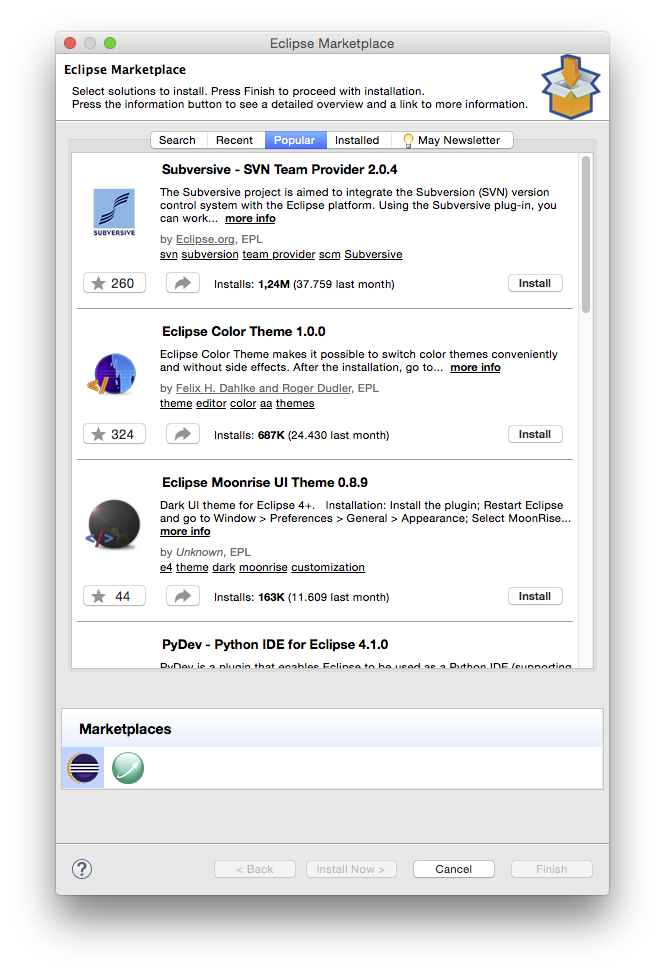
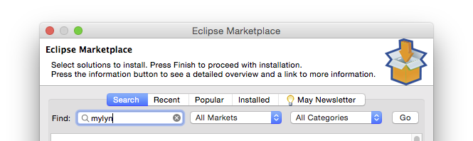
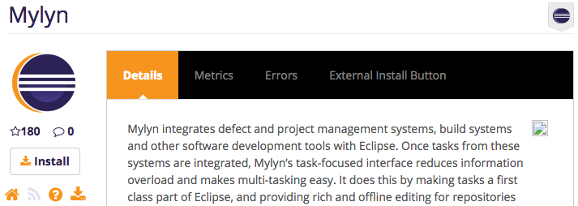
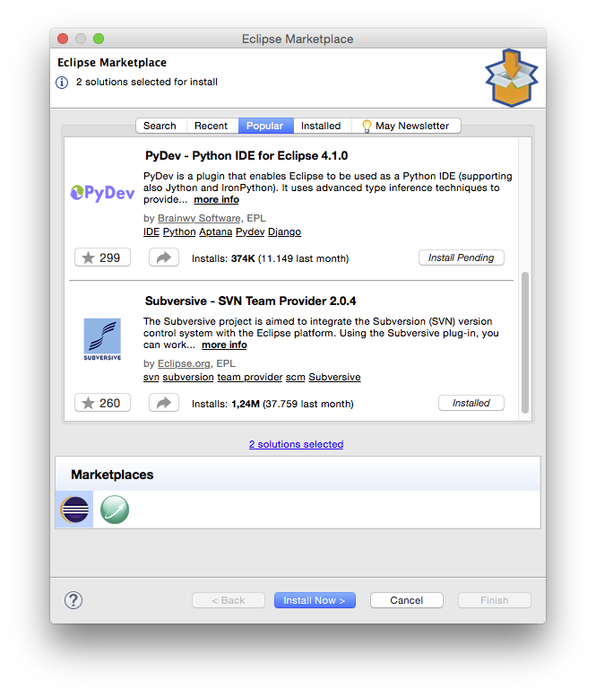
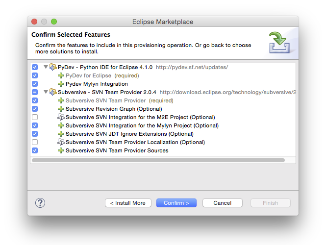
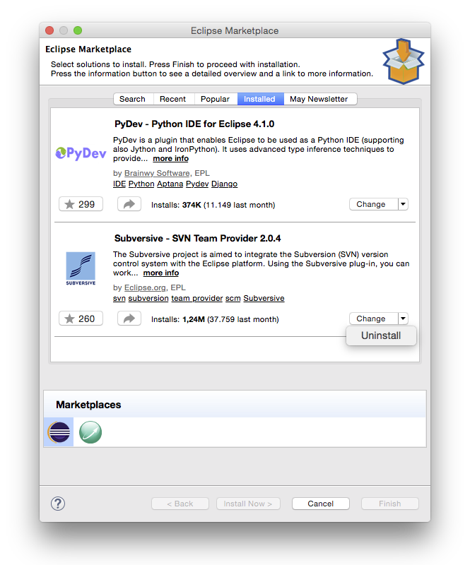
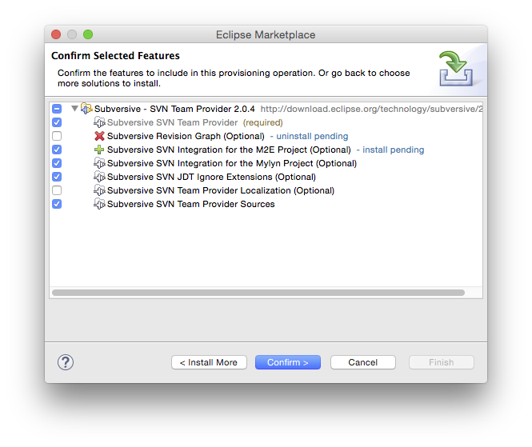
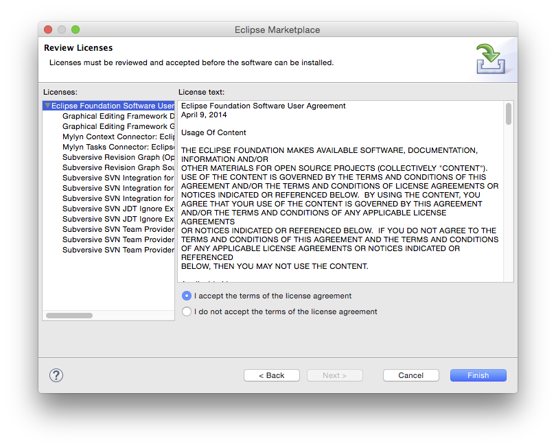

## Overview

This guide provides information on the Eclipse Marketplace Client and how to use it. The Eclipse Marketplace Client provides a means to find and install solutions from the [Eclipse Marketplace](<https://marketplace.eclipse.org>) and other solution catalogs. 

## Getting Started

To launch the Eclipse Marketplace Client select **Help - > Eclipse Marketplace...** from the menu, or click on **Eclipse Marketplace Client** on the Welcome page. The Eclipse Marketplace Client appears as follows: 

## Search

Use the tabs at the top of the wizard to find popular solutions, recently added or updated solutions, installed solutions, or to search.

Searching by specifying the search query, market and category, then press **Go** : 

### Browse For More Solutions

The Eclipse Marketplace Client will provide links to **browse for more solutions** or **Learn more**. Clicking these links will cause the Eclipse Marketplace Client to close and the Marketplace to be opened in a web browser. Browse the marketplace website, and when ready press the **Install** button to reopen the Eclipse Marketplace Client. 

You can also browse the Eclipse Marketplace website at <https://marketplace.eclipse.org> using your favorite browser. Just drag & drop the **Install** button of any item into your Eclipse to install it with the Marketplace Client. 

## Installing and Managing Solutions

Solutions will be displayed with corresponding buttons to install them or to change their installation details:

To install one or more solutions, press the **Install** button. Your first selection will automatically bring you to the next page, where you can confirm selected features for installation. From there, you can either go back to find more solutions to install, or confirm the selected features and press **Next** to proceed: 

Solutions that are already installed show an **Installed** button and can be managed from the tab of the same name. Pressing the button will switch you to that tab. There you have different options to manage the installed features. The button will show you the default action, with more available in a drop-down depending on the solution's state: 

Choosing the appropriate action, you can uninstall or update solutions, or change the installation of optional features: 

### Resolving Errors

Occasionally it's not possible to install solutions due to conflicting or unsatisfied dependencies. Resolve these errors by following the suggestions provided by the installer or by deselecting one or more features. Press **Next** to confirm the resolution. Installation may proceed once all errors have been resolved. 

### Licenses

If necessary you may be prompted to review and agree to license agreements prior to installation:

If you agree, select **I accept the terms of the license agreement**. 

### Completing Installation

Proceed with installation by pressing **Finish**. Installation involves downloading selected components and may take a few minutes or more to complete. You will be able to continue using Eclipse while you wait for downloading and installation to complete. When prompted, either **Apply changes** or **Restart Eclipse** to start using the newly installed solutions. 

## Updating This Document

This document is maintained in a collaborative wiki. If you wish to update or modify this document please visit <http://wiki.eclipse.org/EPP/MPC/User_Guide>
