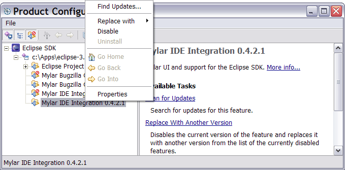
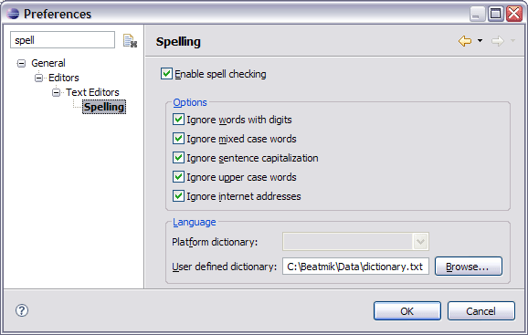

Installation  
   
Mylyn FAQ Task List  
  
* * *

# Installation

  * [Mylyn download page](<http://eclipse.org/mylyn/dl.php>)

As of writing, Mylyn comes bundled with the main EPP distributions ( [jee, java, cpp](<http://www.eclipse.org/downloads/>)). If you wish to manually install Mylyn there are two methods depending on the version of Eclipse. Method 1 outlines how to install using the Eclipse 3.4 update manager. Method 2 below describes how to install Mylyn into Eclipse 3.3 and below using the Update Manager. 

### Install - Eclipse 3.4 and later

  1. Select ''Help > Software Updates...
  2. Select _Available Software_ tab 
  3. Press the _Add Site..._ button 
  4. Enter the Mylyn update site url: 
     1. ` <http://download.eclipse.org/mylyn/releases/latest>`
     2. Additional extension update sites are from [the download page](<http://www.eclipse.org/mylyn/downloads/>)
  5. After pressing _OK_ the update site will be available in the sites list 
  6. Expand the Mylyn update site node and select all components desired
  7. Press the _Install..._ button to install Mylyn 

## What is the release schedule?

  * Weekly builds: available every Wednesday and on-demand (should be used by all Mylyn contributors not self-hosting from CVS [straight from CVS](<http://wiki.eclipse.org/index.php/Mylyn_Contributor_Reference#Self-hosting>)) 
  * Release builds: see the [project plan](<http://www.eclipse.org/projects/project-plan.php?projectid=tools.mylyn>)

## Which sub-projects are included in Mylyn releases?

See the [New &amp; Noteworthy](<http://eclipse.org/mylyn/new/>). 

List of major and release train versions:

Mylyn VersionSub-projects Mylyn BuildsMylyn CommonsMylyn ContextMylyn DocsMylyn ReviewsMylyn TasksMylyn Versions  
[3.8](<http://www.eclipse.org/projects/project-plan.php?projectid=mylyn>) (Juno)1.03.83.81.71.03.81.0  
[3.7](<http://eclipse.org/mylyn/doc/plan-3.6.md>)0.93.73.71.60.93.70.9  
3.6.5 (Indigo SR2)0.8.53.6.53.6.51.5.53.6.5  
3.6.2 (Indigo SR1)0.8.23.6.23.6.21.5.23.6.2  
[3.6](<http://eclipse.org/mylyn/doc/plan-3.6.md>) (Indigo)0.83.63.61.53.60.8  
[3.5](<http://eclipse.org/mylyn/doc/plan-3.5.md>)0.73.53.51.43.50.7  
3.4.3 (Helios SR2)3.4.33.4.31.3.23.4.3  
3.4.2 (Helios SR1)3.4.23.4.21.3.23.4.2  
[3.4](<http://eclipse.org/mylyn/doc/plan-3.4.md>) (Helios)3.43.41.33.4  
  
## What versions of Eclipse are supported?

See the [download page](<http://eclipse.org/mylyn/downloads/>). 

Eclipse VersionMylyn Version 4.53.16 and later  
4.43.10 - 3.18  
4.33.10 - 3.16  
4.2 (Juno)3.7 - 3.10  
4.1Not Supported  
4.0Not Supported  
3.83.7 and later  
3.7 (Indigo)3.5 - 3.9  
3.6 (Helios)3.3 - 3.8  
3.5 (Galileo)3.2 - 3.6  
3.4 (Ganymede)2.1 - 3.4  
3.32.0 - 3.2  
3.21.0 - 2.0  
3.10.6.0  
  
Mylyn also relies on a web browser that works with the Standard Widget Toolkit; Windows and MacOS users are fine, but Linux users might have to download another browser. See [the SWT Browser guide](<http://www.eclipse.org/swt/faq.php#browserlinux>) for which browsers will work. See installing on Linux for instructions. 

## Which repositories are supported?

See the [New & Noteworthy](<http://eclipse.org/mylyn/new/>) for the current supported repository versions. 

#### Mylyn 3.8

  * Eclipse 3.6, 3.7, 3.8, 4.2

  * Bugzilla 3.6, 4.0, 4.2
  * Trac 0.11, 0.12
  * Hudson 2.1.2, 2.2.0
  * Jenkins 1.424.6
  * Gerrit 2.2.2, 2.3

#### Mylyn 3.7

  * Eclipse 3.6, 3.7

  * Bugzilla 3.6, 4.0, 4.2
  * Trac 0.11, 0.12
  * Hudson 2.1.2, 2.2.0
  * Jenkins 1.424.6
  * Gerrit 2.2.1, 2.2.2

#### Mylyn 3.6

  * Eclipse 3.5, 3.6, 3.7

  * Bugzilla 3.0, 3.2, 3.4, 3.6, 4.0
  * Trac 0.10, 0.11, 0.12
  * Hudson 1.367, 2.0, 2.1
  * Jenkins 1.367
  * Gerrit 2.1.5

#### Mylyn 3.5

  * Eclipse 3.5, 3.6

  * Bugzilla 3.0, 3.2, 3.4, 3.6, 4.0
  * Trac 0.10, 0.11, 0.12
  * Hudson 1.367
  * Jenkins 1.367
  * Gerrit 2.1.5

#### Mylyn 3.4

  * Eclipse 3.4, 3.5, 3.6

  * Bugzilla 3.0, 3.2, 3.4, 3.6, 4.0
  * Trac 0.9, 0.10, 0.11, 0.12

## What version of Java is required?

Each Mylyn version has its own specified Java requirements which can be found on the version's review pages. For example, [ Mylyn 3.19](<https://projects.eclipse.org/projects/mylyn/releases/3.19/review>) requires Java 7 or later. 

To check the version of the Java virtual machine that Eclipse was launched with go to _Help → About Eclipse SDK → Configuration Details_ and verify that it meets those requirements. 

Mac users should refer to the last comment on [bug 1163477](<https://bugs.eclipse.org/bugs/show_bug.cgi?id=116347#c4>) for instructions on how to change the 1.4 default. 

  * If you do not have the required Java version, you can download it from [Oracle’s web site](<https://java.com/en/download/>). 
  * If you have more than one VM, you need to specify that Eclipse should use the correct JDK VM. 

In Unix, set the environment variable `JAVA_HOME` to the root of the JDK installation and/or set the `PATH` variable to put the JDK executable directory before any other VM executable directories. For example, under `bash` in Unix:
    
    
    export JAVA_HOME="_(location of JDK root)_ "
    export PATH=$JAVA_HOME/bin:$PATH
    

**We do[not recommend](<https://bugs.eclipse.org/bugs/show_bug.cgi?id=140955>) using JDK 1.6 on Eclipse 3.1.** (It works fine with Eclipse 3.2 or 3.3.) To use JDK 1.6 on Eclipse 3.1, you must add the following line to your `config.ini`file: 
    
    
    org.osgi.framework.executionenvironment=OSGi/Minimum-1.0,OSGi/Minimum-1.1,JRE-1.1,J2SE-1.2,
    J2SE-1.3,J2SE-1.4,J2SE-1.5,JavaSE-1.6
    

## What version of Mylyn is distributed with the Eclipse downloads?

The [default Eclipse downloads](<http://www.eclipse.org/downloads/>) contain the following Mylyn redistributions. Since the redistributed versions can be missing important bug fixes or feature additions, we recommend using the [latest version of Mylyn](<http://www.eclipse.org/mylyn/downloads>). 

  * Eclipse IDE for Java Developers: all of Mylyn except Team integration (e.g. automatic change sets) integration. Install the Eclipse CVS integration and then install the latest Mylyn build to get this component.

  * Eclipse IDE for Java EE Developers: all of Mylyn redistribution, install manually

  * Eclipse IDE for C/C++ Developers: no Mylyn redistribution, install manually

  * Eclipse for RCP/Plug-in Developers: all of Mylyn redistributed

  * Eclipse Classic: no Mylyn redistribution, install manually

## My tasks or queries disappeared, what do I do?

This happens if Mylyn failed to install. First ensure that you have a correct install by following the instructions in the next section. After that, if you still do not see your tasks use the _Task List_ view menu → _Restore Tasks From History…_ command (also available via _File → Import → Task List_. 

## General Installation Troubleshooting

**I’m being asked to restart Eclipse, should I?** Upon installing you will get a dialog box asking if you would like to restart Eclipse. We recommend that you select _Yes_. 

**I’ve installed Mylyn ; why can’t I see anything different?**

The two most likely possibilities are:

  1. You don’t have any Mylyn views open. Select _Window → Show View → Other_ , then select _Mylyn_ and you should see the available Mylyn Views. 
  2. If you still don’t see anything, then perhaps you aren’t using the required JDK VM. See [configuring Java](<http://wiki.eclipse.org/Mylyn_Installation_Guide#Download_and_configure_Java> "Mylyn_Installation_Guide#Download_and_configure_Java"). 

**What does “`Root exception: java.lang.UnsupportedClassVersionError: org/eclipse/mylar/tasklist/MylarTasklistPlugin (Unsupported major.minor version 49.0)`” mean?**

It probably means that the virtual machine is JDK1.4 or lower. See [download and configure Java](<http://wiki.eclipse.org/Mylyn_Installation_Guide#Download_and_configure_Java> "Mylyn_Installation_Guide#Download_and_configure_Java"). 

**What does “Could not create Browser page: No more handles (`java.lang.UnsatisfiedLinkError: …`)” mean?**

It probably means that you are running Linux and don’t have Eclipse and a Web browser configured to work together. See installing on Linux. 

**What does “Could not create Bugzilla editor input” and “`java.io.IOException`: SAX2 driver class `org.apache.xerces.parsers.SAXParser` not found” mean?**

It probably means that you are on MacOS, and for some reason are missing Xerces from the Mac JDK1.5. You will probably need to add it to your default classpath. Please refer to and comment on [bug 144287](<https://bugs.eclipse.org/bugs/show_bug.cgi?id=144287>) if you see this problem. 

To ensure that you are using the required VM refer to the last comment on [bug 1163477](<https://bugs.eclipse.org/bugs/show_bug.cgi?id=116347#c4>) for instructions on how to change the 1.4 default. 

**Startup warnings**

If you see startup errors or warnings such as `BundleException` or timeout messages restart Eclipse with the `-clean` flag either on the command line, in your shortcut link, or by temporarily it into the `eclipse/eclipse.ini` file. These warnings do not cause any bad behavior, but this bug has been fixed in all Mylyn builds after 2.1. The warnings have this form:
    
    
     !MESSAGE While loading class "org.eclipse.mylar.tasks.ui.TasksUiPlugin", thread "Thread
     [main,6,main]" timed out waiting (5000ms) for thread "Thread[Worker-3,5,main]" to finish
     starting bundle "update@plugins/org.eclipse.mylar.tasks.ui_2.0.0.v20070514-1800.jar [809]". 
     To avoid deadlock, thread "Thread[main,6,main]" is proceeding but 
     "org.eclipse.mylar.tasks.ui.TasksUiPlugin" may not be fully initialized.
    

## Installation Troubleshooting on Eclipse 3.4 and later

Ensure that all required update sites are enabled under Help > Software Updates > Available Software > Manage Sites:

  * <http://download.eclipse.org/mylyn/releases/latest>
  * <http://download.eclipse.org/mylyn/incubator/3.13>

Then follow these steps:

  1. Use Help > Software Update > Update to ensure that the latest version of all features is installed
  2. Install again
  3. If Install fails with a "No repository found containing..." message, remove and re-add the update site that hosts the feature for which the download is failing
  4. Install again
  5. If the update fails with a "Cannot complete the request..." message, uninstall Mylyn and all Mylyn dependencies
  6. Install again

### Why does the installation fail with _No repository found_? 

The message indicates that the Eclipse provisioning system P2 has found meta data to install a plug-in but can not locate an artifact repository that provides the required downloads. To recover please remove the Mylyn update sites under _Help → Software Updates… → Available Software → Manage Sites_. Then re-add the sites which will refresh the meta data and artifacts available on the update sites. 

Also see steps under Installation Troubleshooting on Eclipse 3.4 and later. 

### Why does update fail with _Cannot complete the request_? 

If any of the installed features have unsatisfied dependencies or if features where previously installed from the extras or incubator update site P2 may fail with an error similar to the ones below. Try these steps to recover:

  1. Ensure that the Mylyn for Eclipse 3.4 and Mylyn Extras sites are enabled in Software Updates > Available Software > Manage Sites
  2. Select Update from Software Updates > Installed Software
  3. Retry the installation

    
    
     Cannot complete the request. See the details. 
     Mylyn Focused UI (Recommended) is already installed, so an update will be performed instead. 
     Mylyn Task List (Required) is already installed, so an update will be performed instead.
     Mylyn Bridge: Eclipse IDE is already installed, so an update will be performed instead.
     Mylyn Bridge: Java Development is already installed, so an update will be performed instead.
     Mylyn Bridge: Plug-in Development is already installed, so an update will be performed instead.
     Mylyn Bridge: Team Support is already installed, so an update will be performed instead.
     Mylyn Connector: Bugzilla is already installed, so an update will be performed instead.
     Cannot find a solution where both Match[requiredCapability: org.eclipse.equinox.p2.iu/org.eclipse.mylyn.monitor.ui/[3.0.3.v20081015-1500 -e3x,3.0.3.v20081015-1500-e3x]] and Match[requiredCapability: org.eclipse.equinox.p2.iu/org.eclipse.mylyn.monitor.ui/[3.0.1.v20080721-2100-e3x,3.0.1.v20080721-2100-e3x]]can be satisfied.
     […]
    
    
    
    Cannot find a solution satisfying the following requirements org.eclipse.ui [3.4.2.M20090204-0800].
    

Also see steps under Installation Troubleshooting on Eclipse 3.4 and later. 

## Installation Troubleshooting on Eclipse 3.3 and earlier

**Update failures**

First, try running the update again via _Help → Software Updates → Search for new features…_ and ensure that all of the Mylyn features have been updated. 

On Eclipse versions earlier than 3.3 (final) use **only the “Search for new features…”** option when updating Mylyn. If you use “Search for updates…” the Update Manager will allow a partial install that can cause Mylyn to fail to start, and you will need to run update again. See the _feature configuration problem_ section below for details. If you encounter this problemm consider voting for Platform [bug 132450](<https://bugs.eclipse.org/bugs/show_bug.cgi?id=132450>). 

If you have **updated your Eclipse 3.3 to an Eclipse 3.4 milestone** , you will not be able to update the 3.3 copy, because Mylyn has two separate downloads for Eclipse 3.3 and 3.4. Also, not all of the 3.3 version of Mylyn will work in Eclipse 3.4. Install the latest 3.4 version from: <http://www.eclipse.org/mylyn/downloads/>

**Java Persistence API Tools error when updating the JEE Eclipse Package**

If you are trying to install additional features and get this error you have hit [bug 194959](<https://bugs.eclipse.org/bugs/show_bug.cgi?id=194959>) which should be resolved soon. The work-around is to check off the _Europa Discovery Site_ and install the first two components of the _Data Tools Platform_. 

**Subclipse related problems**

If you see the following message:
    
    
      Subclipse Mylyar Integration (1.0.1) requires plug-in "org.eclipse.mylar.tasks.core (0.9.2)",
      or later version
    

You need to uninstall the old (pre 2.0) version of Subclipse and Mylar integration. Most users should not need to do this since the old Mylar 1.x version disabled itself after the update to 2.0. But if you see this error uninstall via: 

  * Help → Software Updates → Manage Configuration
  * Uninstall the Subclipse Mylar Integration (1.0.1)
  * Uninstall the old version of Mylar

**Incompatible VM (e.g. JDK 1.4)**

If you are using the wrong VM, you’ll see errors like the following in your log file. 
    
    
    Root exception: java.lang.UnsupportedClassVersionError:
    org/eclipse/mylar/tasklist/MylarTasklistPlugin (Unsupported major.minor version 49.0)
    

See Configure Java to fix this problem. 

**Incompatible version of Eclipse**

Separate versions and update sites exist [for Eclipse 3.1 and 3.2](<http://eclipse.org/mylyn/dl.php>)), in which case you may see errors like the following in your `<workspace>/.metadata/.log `file or in a Mylyn view: 
    
    
    java.lang.NoSuchMethodError: org.eclipse.ui.internal.dialogs.FilteredTree.getFilterControl()
    The activator org.eclipse.mylar.java.MylarJavaPlugin for bundle org.eclipse.mylar.java is invalid
    

**Mylyn feature configuration problem**

If the above do not address the issue, the easiest thing to do is uninstall any old versions and update to the latest Mylyn. Your tasks won’t be lost, because by default they are stored in the `<workspace>/.metadata/.mylyn` folder which will be read next time Mylyn starts correctly. 

  * First, uninstall the old version of Mylyn using _Help → Software Updates → Manage Configuration_. 
  * You need to Disable all Mylyn features by right-clicking them.
  * Allow Eclipse to restart after the last is disabled.
  * After restart, ensure that the 3rd toolbar button is pressed (figure below) so that you see the disabled features to uninstall.
  * Uninstall all the disabled features using the popup menu. 

If you don’t uninstall, the the Update Manager will think that you have the latest and tell you that there are no updates. 

**Note: manually removing the plug-ins and features can lead to configuration errors.**

After uninstalling, update Eclipse by adding the correct update site specified at on the [download page](<http://eclipse.org/mylar/dl.php>), and after that automatically or manually updating will install the correct version. 

**What do I need to do in installation to be able to use Mylyn task management features with bug/task/issue trackers?**

When you install, make sure that you select a connector for your bug/task/issue tracking software. For example, to use Bugzilla, you have to install the Bugzilla connector component.

**What does the error “Network connection problems encountered during search” mean?**

If you get that message while trying to download Mylyn, it means that Eclipse couldn’t find the location you entered. This might be because you copied something incorrectly (watch for extra characters -- even extra spaces can cause errors), or because the site went down. You may be able to see if the site is up or down by copying the URL into your Web browser.

**What does the “Update manager failure” message mean?**

It means that Eclipse could not access the update site, or that it got confused about the configuration state of your Eclipse. First try updating again to see if the update site is accessible. 

If you are trying to update the JIRA connector you can also try de-selecting that feature in case the `Tigris.org` update site is not accessible. Using _Search for new features to install…_ when installing can help to avoid this problem. If that does not work see the feature configuration troubleshooting below. 

**Why am I getting messages in my`<workspace>/.metadata/.log` or my Mylyn view that say things like “`java.lang.NoSuchMethodError: org.eclipse.ui.internal.dialogs.FilteredTree.getFilterControl()`” and “The activator `org.eclipse.mylar.java.MylarJavaPlugin` for bundle `org.eclipse.mylar.java` is invalid”?**

This probably means that your Mylyn download version didn’t match your Eclipse download version. Note that [the download site](<http://eclipse.org/mylar/dl.php>) has different downloads for Eclipse 3.1 and Eclipse 3.2. 

To fix this problem, see the [uninstallation guide](<http://wiki.eclipse.org/Mylyn_Uninstallation_Guide> "Mylyn_Uninstallation_Guide"), then re-install from [the correct download site](<http://eclipse.org/mylar/dl.php>). 

**Why am I getting messages in my`<workspace>/.metadata/.log` or my Mylyn view that say things like “`java.lang.NoSuchMethodError: org.eclipse.mylyn.internal.context.core.InteractionContextManager.getScalingFactors()`”?**

This could mean that some of your Mylyn plugins are on different versions. Use the update manager (“''Search for new features to install…''”) to obtain the latest versions of the Mylyn features.

**Why doesn’t the Eclipse Update Manager display the latest versions of the Mylyn features?**

It does. Note, however, that if you select both the Mylyn site and the Weekly Builds site, using “''Search for new features to install…''”, you must uncheck the “''Show the latest version of a feature only''” checkbox in order to see the updates available on both sites.

**I’ve just updated to Mylyn 2.0 and I don’t see any tasks in my Task List**

As part of the update to Mylyn 2.0 the old data folder has been migrated to <workspace folder>/.metadata/.mylyn from the old location <workspace folder>/.mylar. IF for some reason migration failed (.mylar folder still exists), simply shut down Eclipse and manually move your old <workspace folder>/.mylar folder to <workspace folder>/.metadata/.mylyn (note the name change to .mylyn)

**Error: Network connection problems encountered during search** Eclipse couldn’t find the location you entered. This might be because you copied something incorrectly (watch for extra characters -- even extra spaces can cause errors), or because the site went down. You might be able to see if the site is down by copying the URL into your Web browser. 

**Error: Update manager failure** Eclipse could not access the update site, or that it got confused about the configuration state of your Eclipse. First try updating again to see if the update site is accessible. If you are trying to update the JIRA connector you can also try de-selecting that feature in case the Tigris.org update site is not accessible. Using use _Search for new features…_ when installing can help to avoid this problem. You will probably get a warning that **the feature is unsigned**. If you trust that hackers have not befouled the Mylyn plug-in, select _Install All_. 

## Why can't I update Mylyn 3.0 to a newer release?

The update site link in the 3.0 and 3.0.1 features for Eclipse 3.3 points to the Mylyn for Eclipse 3.4 update site ( [bug 244618](<https://bugs.eclipse.org/bugs/show_bug.cgi?id=244618>)). An attempt to update will result in an error: “Mylyn Task List (Required) (3.0.1.v20080721-2100-e3x) requires plug-in "org.eclipse.ui (3.4.0.I20070918)", or later version.” 

To resolve the error follow these steps:

  1. Open update **Help → Software Updates → Find and Install…**
  2. Select **Search for new features…** and **Next**
  3. **Uncheck Mylyn**. Add a **New Remote Site** : 
     * Name: **Mylyn for Eclipse 3.3**
     * URL: **<http://download.eclipse.org/tools/mylyn/update/e3.3> **. 

Make sure the new site is selected and select Finish to proceed with the update.

## Installing on Linux

### How can I get the SWT internal browser to work under Linux?

Mylyn uses the Standard Widget Toolkit Browser, and users have experienced problems with the SWT Browser on Linux. This is not a Mylyn specific problem and also occurs if you try to use Eclipse’s Browser view. To test to see if your browser is properly configured, select _Window → Show View → Other → General → Internal Web Browser_ , then try to load a web page. If the internal browser is problematic, consider enabling the external default browser (i.e. Firefox) via _Window → Preferences → General → Web Browser_ and select the **Use external Web browser** option. 

### I’m getting a “Could not create Browser page: No more handles” error

When the Browser is not properly configured exceptions such such as “Could not create Browser page: No more handles (`java.lang.UnsatisfiedLinkError: …`)” will appear when attempting to open tasks. See [the SWT Browser guide](<http://www.eclipse.org/swt/faq.php#browserlinux>) for which browsers will work. 

### I’m having unstable performance on Linux with a Sun JVM are there options?

For those experiencing unstable performance with Linux using the Sun JVM, try the [IBM JVM](<http://www-128.ibm.com/developerworks/java/jdk/linux/download.md>), which will require you to register with IBM prior to download. We’ve also had good reports from those using JRockit JVM. 

### Memory consumption problem with internal browser on Linux-GTK

If you are experiencing abnormal memory consumption upon launching the internal browser (or opening repository tasks), try shutting down eclipse, renaming/moving your `~/.mozilla/eclipse` folder and relaunching eclipse. (see [bug#172782](<https://bugs.eclipse.org/bugs/show_bug.cgi?id=173782>)) 

### Error: No more handles error
    
    
    (java.lang.UnsatisfiedLinkError: no swt-mozilla-gtk-3449 or swt-mozilla-gtk in swt.library.path, java.library.path or the jar file)
    

To resolve this error install a package that provides the Gecko engine library. On Ubuntu and Debian the package is called libxul0d.

### Recommended Settings for GTK

[This article](<http://blog.xam.dk/archives/81-Making-Eclipse-look-good-on-Linux.md>) describes how to improve the visual appearance of Eclipse on GTK. 

### Recommended GTK Setup for KDE

The recommended GTK theme to use for KDE (and KDE based distributions like Kubuntu) is the “Human” theme. (Possibly, this is also a good recommendation for GNOME. GNOME users, please comment.)

With Debian based distributions (e.g. Ubuntu), this theme can be installed with
    
    
     aptitude install human-theme
    

The appearance of GTK applications is controlled by the KDE System Settings / Control Center in the section “Appearance”.

GTK Styles and Fonts: GTK Styles: Select “Use another style [Human]”

Colors: At bottom: [x] Apply colors to non-KDE applications

These changes are applied to these two GTK configuration files, respectively:

  * `$HOME/.gtkrc-2.0-kde`
  * `$HOME/.kde/share/config/gtkrc-2.0`

### Solving issues with KDE environment variable settings

Most of the known UI issues below are due to a broken environment variable setting. The environment variable `GTK2_RC_FILES` contains a search path to find the GTK configuration files to be used by the GTK application and can be checked with 
    
    
     env | grep GTK2_RC_FILES
    

The correct setting is obtained by
    
    
     export GTK2_RC_FILES=$HOME/.gtkrc-2.0-kde:$HOME/.kde/share/config/gtkrc-2.0 _# Bourne shell_
     setenv GTK2_RC_FILES $HOME/.gtkrc-2.0-kde:$HOME/.kde/share/config/gtkrc-2.0 _# C shell_
    

**Important note:** The used environment setting seems to differ depending on the way KDE starts the application: from Konsole, using “Run Command…”, using a desktop icon etc. Please use this simple script to check the different ways: 
    
    
     #!/bin/bash
     env | grep GTK2_RC_FILES >/tmp/GTK2_RC_FILES.env
    

and look at the resulting output in `/tmp`.

Consider filing a bug against the distribution showing this inconsistent behaviour.

### Known UI issues with KDE

There a couple of bugs related to UI features not working in specific Linux distributions:

  * [176716: Task colors are not displayed](<https://bugs.eclipse.org/bugs/show_bug.cgi?id=176716>)
  * [173928: Task acivate button does not work under linux](<https://bugs.eclipse.org/bugs/show_bug.cgi?id=173928>)

Debian 3.1 (sarge) with KDE and standard X11 installation (XFree86) works fine for all three issues.

Debian testing (etch) with KDE and new X11 installation (X.Org) has issues with the color display (bug 176716 and 135928), but the Task Activate button works.

Kubuntu Dapper 6.06 with KDE and X.Org triggers all above issues. An upgrade to Edgy enables Task Color display and the date picker selection. To get the Task Activation button working you have to use Edgy and Eclipse 3.3M5eh (or newer).

Kubuntu Gutsy 7.10 has issues with the color display (bug 176716). A workaround is to change the GTK-Style to “Human”. More details and another solution in the comments of bug 176716.

## Installing on MacOS

If you see errors like the following it may be due to Xerces missing from the Mac JDK so you may need to add it to your default classpath. Please refer to and comment on [bug 144287](<https://bugs.eclipse.org/bugs/show_bug.cgi?id=144287>) if you see this problem. 
    
    
       Could not create Bugzilla editor input
       java.io.IOException: SAX2 driver class org.apache.xerces.parsers.SAXParser not found
    

To ensure that you are using the 1.5 VM refer to the last comment on [bug 1163477](<https://bugs.eclipse.org/bugs/show_bug.cgi?id=116347#c4>) for instructions on how to change the 1.4 default. 

## Configuration Troubleshooting

### The default Key Mappings aren’t working correctly, what can I do?

If default key mappings aren’t working, try doing the following to reset them:

  * _Window → Reset Perspective_
  * _Then: Window → Preferences → Keys → Restore Defaults_

#### Linux key mappings a problem?

If you are running Mylyn on X-Windows, for example on Linux, FreeBSD, AIX and HP-UX, some keyboard bindings may not work by default.

If the `Ctrl+Alt+Shift+Arrow Up` shortcut for _Mark as Landmark_ does not work do the following: 

  * _Menu Bar → Desktop → Control Center → Keyboard Shortcuts → Move one workspace up, Move one workspace down_ : disable both. 

If `Alt+Click` quick unfiltering does not work try one of the following:

  * Hold down the `Windows` key while holding `Alt`, if available (ironic, but unsurprisingly this key is not usually mapped on Linux).
  * Disable the `Alt+drag to move` functionality:

GNOME Desktop

  1. Open a terminal and run `gconf-editor`
  2. Go into: `/apps/metacity/general`
  3. Edit the `mouse_button_modifier` field. Setting it to nothing disables it. You can use <Super> to set it to the windows key.
  4. Exit `gconf-editor`.

KDE Desktop

  1. Run the _KDE Control Center_. 
  2. Go to the _Desktop/Window Behavior_ panel and select the _Window Actions_ tab. 
  3. Down in the _Inner Window, Titlebar & Frame_ area, change the _Modifier Key_ option from `Alt` to `Meta`. 

### How do I enable spell checking in Eclipse 3.2 and older?

On Eclipse versions earlier than 3.3, the spell checking must be set up manually. Spell checking is supported in the task editor for local tasks and for connectors that support rich editing (e.g. Bugzilla, Trac).

  * To install spell checking for editors that support it you need to enable the preference in _General → Editors → Text Editors → Spelling_. 
  * You also need to install a dictionary, some instructions are [here](<http://www.javalobby.org/java/forums/t17453.md>). A word list is available [http://wordlist.sourceforge.net/ here](<http://wiki.eclipse.org/http://wordlist.sourceforge.net/_here> "http://wordlist.sourceforge.net/ here") as well. 

### How can I change the number of editors left open before Mylyn starts closing editors?

Turn off or increase the number of editors to leave open using _Preferences → General → Editors → Number of opened editors before closing_. Since Mylyn will manage the open editors with task activation, this number can be set higher or you can disable automatic closing entirely. 

### Do I need the Outline View when running Mylyn?

No, not really. The Package Explorer and folded signatures should provide enough context for you. If, at some point, you really need to see an Outline View, you can always enter (Ctrl+O) to show the in-place Outline View.

### What does the message “content assist proposals no longer appear” mean?

This usually happens when uninstalling when using Eclipse 3.2. Make sure that the “Java Completions” and “Java Types” proposal categories are included in the default proposals via: _Preferences → Java → Editor → Content Assist → Advanced → Restore Defaults_. Also see: [content assist troubleshooting](<http://wiki.eclipse.org/Mylyn_FAQ#Content_assist_troubleshooting> "Mylyn FAQ#Content assist troubleshooting"). This [bug](<https://bugs.eclipse.org/bugs/show_bug.cgi?id=140416>) has been fixed in Eclipse 3.2.1. 

### Why do I get errors like “HTTP Response Code 407” or “Proxy Authentication Error” when accessing repositories through a proxy server?

It is likely that you need to configure these proxy server settings. Select _Window → Preferences → General → Network Connections_ , and update the section in the “Proxy settings” section of the form. 

### I can’t use `Ctrl+Alt+Shift+Arrow Up` for'' Mark as Landmark''. What do I do?

This is usually a Linux/GNOME problem, where the Gnome keyboard shortcuts are interfering with the Eclipse shortcuts. Go to the Keyboard shortcuts (which might be something like _Desktop → Control Center → Keyboard Shortcuts_ or _System → Preferences → Keyboard Shortcuts_) and disable both of these shortcuts: 

  * Move one workspace up
  * Move one workspace down

See also: keyboard mappings on Linux. 

### Why do I get an error when accessing secured web sites?

The internal browser may display an error if the web site certificate is not trusted and block access to the site:
    
    
    (Error code: sec_error_unknown_issuer)
    

On Linux start `firefox -profile ~/.mozilla/eclipse -no-remote` from the command line and open the web site in Mozilla Firefox. Add an exception for the web site and restart Eclipse. The site should now be accessible from Eclipse.

**Notes**

  1. `-no-remote` is added because it would otherwise open a new window in the running process. You’re probably viewing this page in firefox, so the command above will not work without `-no-remote`.
  2. Replace `firefox` by the exact command that you use to start your Mozilla browser.

## Uninstall troubleshooting

We recommend **uninstalling in Eclipse** via the _Help → Software Updates → Manage Configuration_ dialog. If you get an error message when trying to uninstall, you will need to first uninstall dependencies that use Mylyn. These include things like the Subclipse Mylyn integration and the Bugzilla Connector. 

You can also **uninstall manually** by deleting all of the Mylyn plug-ins and features from the `eclipse/plugins` and `eclipse/features` directory make sure to delete all of the plug-ins and then restart Eclipse with the -clean option (e.g. by inserting it into a shortcut or the `eclipse.ini` file. 

On **Eclipse 3.2:** if after uninstalling **content assist proposals no longer appear** you need to ensure that the _Java Completions_ and _Java Types_ proposal categories are included in the default proposals via: _Preferences → Java → Editor → Content Assist → Advanced → Restore Defaults_. Also see: [content assist troubleshooting](<http://wiki.eclipse.org/Mylyn_FAQ#Content_assist_troubleshooting> "Mylyn FAQ#Content assist troubleshooting"). This [bug](<https://bugs.eclipse.org/bugs/show_bug.cgi?id=140416>) has been fixed in Eclipse 3.2.1. 

On **Eclipse 3.1:** you may need to reset the Java editor to be default for `.java` again via: _Preferences → General → Editors → File Associations_

## Why am seeing `java.lang.OutOfMemoryError: PermGen space` errors?

If your Eclipse crashes, or you see the above error after installing Mylyn or other plug-ins, you have most likely hit the infamous MaxPermSize bug. This is not a Mylyn specific problem, but a general problem with the Sun Java VM that is often triggered on Eclipse 3.2 and later, if you have many plug-ins installed.

To fix it simply add the following to your launch arguments. This is usually to your shortcut:
    
    
       -vmargs -XX:MaxPermSize=128m
    

Or to the `eclipse/configuration/config.ini` file:
    
    
       -XX:MaxPermSize=128m
    

Note: For Eclipse 3.4 with the Equinox P2 profile-based provisioning support, this setting can also be modified in the current P2 profile. With a default installation of the SDK, see: 

@config.dir/../p2/org.eclipse.equinox.p2.engine/profileRegistry/<name>.profile/<timestamp>.profile

For more information, see: <http://wiki.eclipse.org/Equinox_p2_Admin_UI_Users_Guide>

If you are using a very large number of plug-ins (e.g. WTP) and still get this error you may need to increase the number to 256M. Note that on some VMs the size may need to be a power of 2 and may drop down to the default (e.g. 32M) if it is not accepted.

Eclipse 3.3.1 users: note note that due to Platform [bug 203325](<https://bugs.eclipse.org/bugs/show_bug.cgi?id=203325>) you need to use the instructions above and cannot set the size using `-launcher.XXMaxPermSizeL`, which will be ignored. 

For more information see the [Eclispe FAQ entry](<http://wiki.eclipse.org/FAQ_How_do_I_increase_the_permgen_size_available_to_Eclipse?> "FAQ How do I increase the permgen size available to Eclipse?"). Details of the problem are on [Platform bug 92250](<https://bugs.eclipse.org/bugs/show_bug.cgi?id=92250>). 

## What is Mylyn’s performance profile?

Mylyn should have **no noticeable effect** on Eclipse’s speed or memory usage, no matter how large your workspace is. You do not need to increase the amount of memory Eclipse runs with to use Mylyn. Any performance issue should be [reported as a bug](<https://bugs.eclipse.org/bugs/enter_bug.cgi?product=Mylyn>). 

The current **performance profile** is: 

  1. Mylyn only runs if a task is active, and has no impact on Eclipse if no task is active.
  2. Task context models have negligible memory overhead. 
  3. When a task is active, additional view refresh is required to update the views based on interest model changes. This should not be noticeable on Windows where refresh is very quick, but could be more noticeable on other platforms.
  4. The time to activate a task context is dominated by the time it takes Eclipse to open the editors in the context. You can set the preference for how many editors to open in the Mylyn preference page (e.g. setting to 1 will dramatically reduce activation time, but also remove the benefit of having open editors correspond to the task context). You can also turn off editor management entirely in the Mylyn Tasks view pull-down.
  5. Eclipse startup is slowed down by (4) if a task is active when Eclipse is shut down.
  6. The low priority background searches that the Active Search view runs can be noticeable on slower machines.

**If you are seeing performance problems, this is either a bug, or caused by other performance problems in other Eclipse plug-ins** '. If you are performance problems we suggest increasing the amount of memory available to Eclipse. This is especially useful for very large Java project workspaces, on which the size of JDT’s element cache will grow proportionally to the amount of available memory. The setting we recommend for launching workspaces with a couple hundred large projects is: 
    
    
     -Xmx768M -XX:MaxPermSize=128M
    

**If you are seeing content assist timeouts** that indicate the Mylyn proposal computer did not complete quickly enough, note that the problem is not with Mylyn, but with the standard content assist mechanism timing out due to an intensive computation (eg, a large number of matches). In this scenario switching or [disabling the Mylyn proposal computers](<http://wiki.eclipse.org/Mylyn_FAQ#Content_assist_troubleshooting> "Mylyn_FAQ#Content_assist_troubleshooting") does not help improve performance, although it will get rid of those messages. 

* * *

    
Mylyn FAQ Task List
