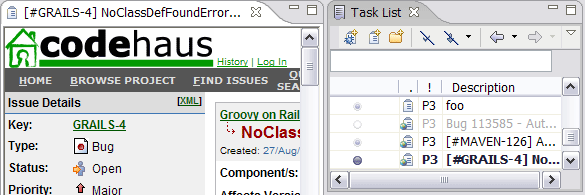
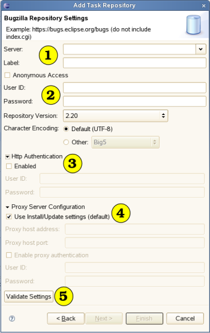
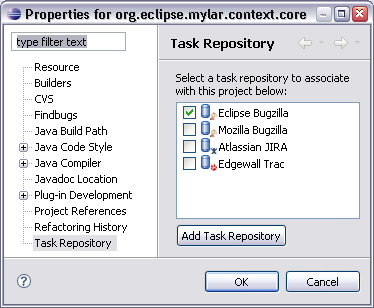

Task Repositories  
   
Task Editor Bugzilla Connector  
  
* * *

# Task Repositories

## What if I’m not using a Task Repository?

Mylyn does not require the use a of a task repository and can be used entirely with the _Local Tasks_ repository that it comes bundled with. However, if working with a team, a shared _Task Repository_ provides the key infrastructure needed to let your team work in a Task-Focused way via Mylyn’s collaborative facilities. 

Those not currently using another supported _Task Repository_ should consider the repositories currently [supported by Mylyn](<http://www.eclipse.org/mylyn/downloads/>) as well as those supported by the [third party Mylyn extensions](<http://wiki.eclipse.org/index.php/Mylyn_Extensions>). 

## What if Mylyn doesn’t support my task/bug/issue/ticket repository?

To see support for your repository faster, do a search of the open repository connector requests and [vote for the corresponding bug](<https://bugs.eclipse.org/bugs/buglist.cgi?query_format=advanced&short_desc_type=anywordssubstr&short_desc=%5Bconnector%5D&product=Mylyn&long_desc_type=allwordssubstr&long_desc=&bug_file_loc_type=allwordssubstr&bug_file_loc=&status_whiteboard_type=allwordssubstr&status_whiteboard=&keywords_type=allwords&keywords=&bug_status=NEW&bug_status=ASSIGNED&bug_status=REOPENED&emailtype1=substring&email1=&emailtype2=substring&email2=&bugidtype=include&bug_id=&votes=&chfieldfrom=&chfieldto=Now&chfieldvalue=&cmdtype=doit&order=Reuse+same+sort+as+last+time&field0-0-0=noop&type0-0-0=noop&value0-0-0=>) if your tracker is there, or [create a new bug](<http://www.eclipse.org/mylar/bugs.php>). 

[Generic Repository Connector](<../../Mylyn/User_Guide/Task-Repository-Connectors.md#Generic_Web_Templates_Connector> "Mylyn/User_Guide#Generic_Web_Templates_Connector"), allows creating Queries to the web-based issue tracking repositories and get list of issues from the web UI into the Task List. 

It is also possible to link a _local task_ with the web page in web-based repository via the Mylyn Web integration. 

**To create a task from any web-based repository:**

  * Drag the URL from the address bar of the browser, or from a hyperlink in a bug listing to the _Mylyn Tasks_ view. This will create a task for the bug, link it to the page, and populate the description with the title of the corresponding page. **In Mozilla:** simply drag the URL. **In Internet Explorer:** you must have `Ctrl` pressed in order for Eclipse to recognize the drop. 
  * **Alternatively,** you can copy the URL, press the _New Task_ button on the _Mylyn Tasks_ view. This has the same effect as above but you can edit the description after retrieving it. 
  * Opening the task will now open the corresponding issue. You can also `right+click` the task and select _Open in External Browser_. 

## Why were my repository credentials reset?

If you upgrade Eclipse or your Java VM, you will need to reset your credentials in the _Task Repositories_ view because these are stored in the secure Eclipse workbench keyring. Also see [bug 149607](<https://bugs.eclipse.org/bugs/show_bug.cgi?id=149607>). If you are migrating **from Eclipse 3.2 to 3.3** note that you will need to use a different update site, which is listed here: <http://eclipse.org/mylyn/dl.php>

## Why are my updated repository attributes not showing up?

Your server’s repository attributes can change frequently, for example, there can be a new "milestone" or "version" added to the Bugzilla repository with each release. When the _Preferences → Mylyn → Task List → Synchronization_ setting is enabled, every 10th synchronization will update the attributes from the repository. If you do not have this setting enabled, your can force the update via the _Update Attributes_ action on the task repositories’ context menu in the _Task Repositories_ view. Note that you will need to reopen a task editor to see the updated attributes. If you instead update via the button on the _Attributes_ section of the _Task Editor_ the attribute settings will be reloaded without needing to reopen. 

**bugs.eclipse.org users** : Note that the attributes listing on eclipse.org is mirrored, and the mirrors are only updated 24 hours. As such, you may need to wait up to 24 hours for the new attributes to show up. 

## Authentication Troubleshooting

You must ensure repository credentials are filled out correctly. Refer to the diagram below:

  1. Enter the repository URL (i.e. <https://bugs.eclipse.org/bugs>) and an optional label 
  2. Credentials 
     * Usually email address and password 
     * Some sites, such as `dev.eclipse.org`, use anonymous logon with password left blank.
  3. Http Authentication (optional) 
     * Some sites are protected by either BASIC or DIGEST http authentication. If this is the case, enter appropriate credentials here.
     * One way to test if the site requires http authentication is to point your browser at the repository. If you are presented with an authentication dialog popup, the site is likely protected by http authentication.
  4. Proxy Server Configuration (optional) 
     * By default Mylyn uses the Platform’s Install/Update proxy settings. Uncheck this box if you wish to use an alternative proxy.
     * If the proxy requires authentication, this is where you enable and enter your proxy credentials.
     * If you are experiencing connection problems, ensure your Install/Update proxy settings are valid or the repository specific settings are correct
     * Mylyn has been tested with HTTP proxy servers. Currently SOCKS is not supported.
  5. Validate Settings 
     * Press the _validate_ button to test the settings 
     * If you are seeing errors like “HTTP Response Code 407” or “Proxy Authentication Error” it is likely that you need to configure proxy settings as described above.
     * If your sever uses a certificate and fails to connect, e.g. you see exceptions `sun.security.validator.ValidatorException: PKIX path building failed` then you need to point Eclipse at your certificate, see below.

### Certificate authentication

Mylyn supports authentication with certificates from a Java keystore. The path and password to the keystore need to be specified in system properties. These can be set in the eclipse.ini in your eclipse install directory:
    
    
    -vmargs
    …
    -Djavax.net.ssl.keyStore=/path/to/.eclipsekeystore
    -Djavax.net.ssl.keyStorePassword=123456
    

If your keystore does not have the default type (JKS) you can specify a different type:
    
    
    -Djavax.net.ssl.keyStoreType=PKCS12
    

#### Creating a keystore

If you do not have a client certificate you can create one and have it signed by a CA:
    
    
    keytool -genkey -keyalg DSA -keysize 1024
    

Use this command to create a new certificate signing request:
    
    
    keytool -certreq > client.csr
    

Submit the client.csr file to your CA for signing. The CA’s certificate as well as your signed certificate that is returned by the CA need to be imported into the keystore:
    
    
    keytool -importcert -alias ca -file ca.crt
    keytool -importcert -file client.crt
    

See [this page](<http://java.sun.com/j2se/1.5.0/docs/guide/security/SecurityToolsSummary.md>) for links to the keytool documentation. 

### NTLM authentication

For NTLM authentication to work a special format for the username needs to be used where _DOMAIN_ needs to be replaced by the Windows login domain: 
    
    
    DOMAIN\username 
    

The built-in NTLM support of the JDK which is used by Eclipse does **not work** with Mylyn since it uses the HttpClient library to access repositories. Limitations in regard to NTLM authentication are documented in the [NTLM FAQ](<http://wiki.apache.org/jakarta-httpclient/FrequentlyAskedNTLMQuestions>) and also discussion on [bug 201911](<https://bugs.eclipse.org/bugs/show_bug.cgi?id=201911>). 

  * If your repository uses MS NTLM authentication and only standard http authentication is being passed to the repository this can result when the local hostname cannot be resolved. Ensure your machine’s hostname is set correctly and resolves to a valid address.
  * It is not possible to use NTLM authentication for the proxy as well as for the repository.

If NTLM authentication fails the **[NTLM Authorization Proxy Server](<http://ntlmaps.sourceforge.net/>) ** has been reported to **work** with Mylyn. 

## Network Troubleshooting

### Performance Problems with HTTPS

The built-in SSL support of the JDK will to a name lookup for each new connection. In case your network setup cannot resolve the host name (e.g. no proper name server), this lookup will time out, delaying the whole job. If setting up a name server is not an option, a work around would be to edit your local hosts file, and add the server IP there (and, if possible, add your computer's IP to the server's hosts file).

### Error "Received fatal alert: bad_record_mac" when using https

The SSL handshake can [fail with some servers](<http://docs.oracle.com/javase/1.4.2/docs/guide/plugin/developer_guide/faq/troubleshooting.md>) and result in an exception when connecting. If you are experiencing a bad_record_mac error set the following [system property](<http://wiki.eclipse.org/Mylyn/FAQ#System_Properties>) in the eclipse.ini: `-Dorg.eclipse.mylyn.https.protocols=SSLv3`

## Why are task hyperlinks not working?

For task hyperlinks in textual editors (e.g. Java editor) and other text viewers (e.g. History view comments) you must associate the project that contains the resource to the task repository. 

     _Project association can also come from 3rd party metadata trough the contrubuted[extension point](<http://wiki.eclipse.org/Mylar_Integrator_Reference#Mapping_from_projects_to_Task_Repositories> "Mylar_Integrator_Reference#Mapping_from_projects_to_Task_Repositories"). [Maven integration for Eclipse](<http://docs.codehaus.org/display/M2ECLIPSE/Integration+with+Mylyn>) plugins contributing it. See few more details [here](<http://jroller.com/page/eu?entry=linking_projects_from_the_eclipse>). _

Note that to view a hyperlink you must hold down the `Ctrl` key when hovering over the reference to the task. References to tasks are connector specific and the common reference is found on the top left of the task editor and other conventions tend to follow those used in the web UI (e.g. “bug 123” for Bugzilla, “ABC-123” for JIRA).

* * *

    
Task Editor Bugzilla Connector
