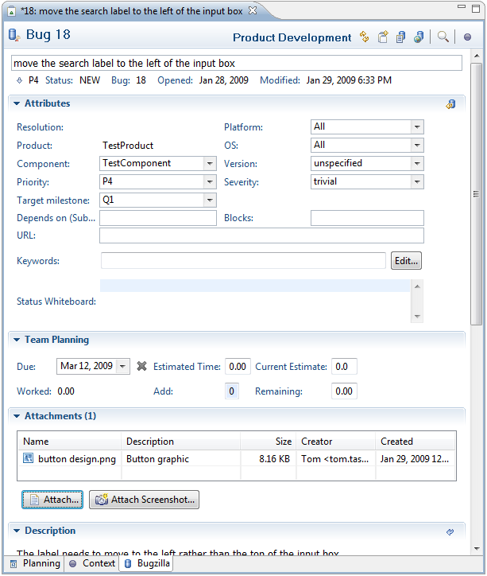
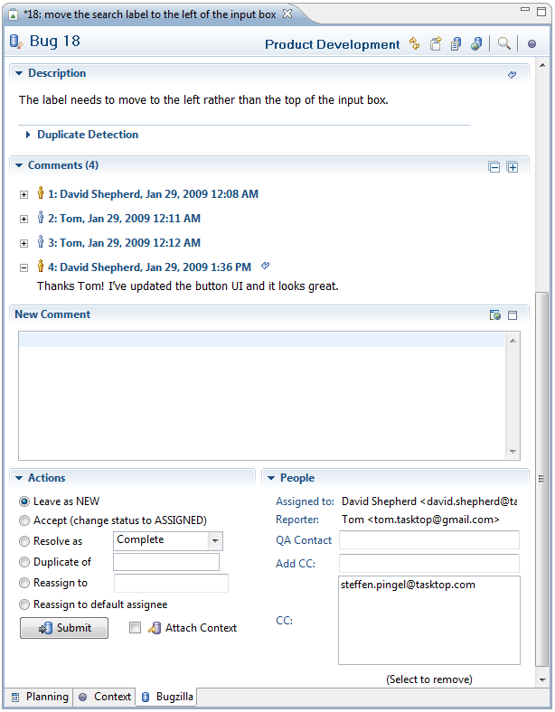
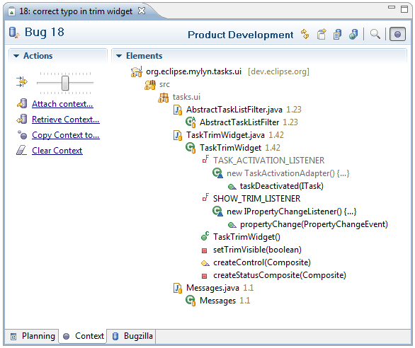
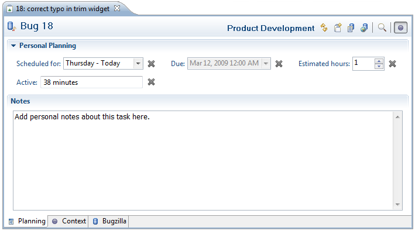

Task Editor  
   
Task Repositories Task-Focused Interface  
  
* * *

# Task Editor

The task editor allows you to view and edit the tasks in your task list. Double-click on a task in your task list to open the editor. The features of the task editor will vary depending on whether it is a local task or a shared repository task. For shared repository tasks, there are some differences depending on the type of repository (and corresponding connector) that you are using (link: connectors). 

## Repository Task Details

In this section, we describe the task editor for shared bugs in a Bugzilla repository. Task editors for other repository types such as Trac offer similar functionality.

**Editor toolbar buttons**

  * **Synchronize Incoming Changes** \- Updates the local copy of the task to reflect any changes on the server. 
  * **Create a new subtask** \- Creates a new task that will be considered a prerequisite to completing the current task. Subtasks appear nested under their parent task in the task list. In Bugzilla terminology, the subtask "Blocks" the parent task and the subtask's ID will appear in the "Blocks:" field of the parent task. 
  * **History** \- Displays the task's change history in an internal browser using the web interface. 
  * **Open with Web Browser** \- Displays the web interface for the task in an internal web browser. 
  * **Find** \- Find text in comments, description, summary and private notes. 
  * **Activate** \- Toggles the activation and deactivation of the task. 

**Attributes** Use the Attributes section to add or update structured information about the task. 

**Team Planning** The Team Planning section contains time-related information about the task that will be shared with your team. You can use the **Due** field to set a due date for your task. On the due date, the task will appear in red in your task list. 

**Attachments** You can attach a file to this task so that a copy will be uploaded to your task repository and become available to anyone who can access the task. 

To attach a file

  * click the "Attach..." button, which will open a wizard.
  * Select from one of the following: 
    * **File** \- Uploads a file from your system. Click "Browse" on the right to select the file. 
    * **Clipboard** \- 
    * **Workspace** \- Uploads a file from your workspace. Select the file from the box below. 
  * Click next to enter attachment details: 
    * **Description** \- Provide a brief description of the file. This description will appear in the attachment list in the task editor. 
    * **Comment** \- Provide a comment about the file. This comment will appear in the comments section of the task editor. 
    * **Content Type** \- Optionally specify a content type for the file 
    * **Patch** \- Check this if the attachment is a source code patch file 
    * **Attach Context** \- Check this if you would also like to attach the context of your task. This context describes the resources that are most relevant to the task. If you attach a context, others can download it and focus the UI on the same resources that are relevant to you. 
    * Click "Next" to preview your file. If your file is an image, a preview of the file will appear.
    * Click "Finish" to upload the file to the task repository. Files are uploaded without the need to click "submit" at the bottom of the task editor.

**Duplicate Detection** When submitting bug reports, you can avoid duplicates by clicking the "Search" button. This will search the repository for a stack trace that matches a stack trace in the task's Description field. The results of the duplicate detection show up in the Search view. If a match is found, you can open it and comment instead of creating a new bug report. 

**Comments** Use this section to add new comments about the task and view all previous comments. Comments you have read previously are folded. You can expand and re-read individual comments or click the "+" at the top right to expand all comments. 

**Actions** Use this section to change the task's status or reassign the task to another person. 

  * **Attach Context** \- Uploads information about the resources that you have interacted with to the server. The context will appear in the attachments list so that others can download it and focus their UI on the resources that you found relevant for this task. 
  * **Submit** \- Submits all local changes to the task to your team's shared task repository. 

**People** This section shows the people who are collaborating on the task. 

  * **Assigned to** \- This is the person who is responsible for completing the task 
  * **Reporter** \- This person created the task 
  * **QA Contact** \- 
  * **Add CC** \- Use this box to add new people to the "CC" list. People on the "CC" list will be notified of any changes to this task. To add a new person, type the start of their email address and then press ctrl+space to complete the address using content assist. You can add several addresses, separated with a comma. 
  * **CC** \- This box shows the people who are currently on the "CC" list. To remove a person, simply select their email address so that it is highlighted and click "Submit". You can hold down ctrl to select multiple people. 

## Context

The context tab allows you to manage the context of resources associated with the task. You can view the context tab by selecting it in the lower left of the editor window.

**Elements**   
This section lists the resources that are part of the task's context. Because the number of elements may be large, you can adjust the level of detail using the slider at the top of the _Actions_ section. Sliding the control all the way to the left will show you all elements in your task context. As you slide to the right, only the elements with a high level of interest will be displayed. You can manually remove elements from your task context by right-clicking and selecting "Remove From Context". You may choose to view all elements and prune irrelevant items in this way before attaching the context to the task so that others can download it. 

**Actions**   

  * **Element Detail Slider** \- Adjusts the minimum level of interest required for an element to be displayed in the _Elements_ section. 
  * **Attach Context** \- Attaches the context to the task so that it is available for download from the shared task repository. The context consists of the elements shown on the right. 
  * **Retrieve Context** \- Replaces the current task context with one that is attached to the task in the shared task repository. 
  * **Copy Context to...** \- Copy the task context to another task. That task will then have the same context as the current task. 
  * **Clear Context.** \- Removes all context information from the task. 

## Planning

Use the planning tab to access local information about the task that is private to your workspace. You can view the planning tab by selecting it in the lower left of the editor window. This tab contains a large area where you can enter personal notes about the task. See the local task section for more information about fields in the Personal Planning section.

* * *

    
Task Repositories Task-Focused Interface
