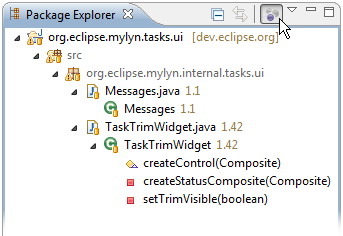
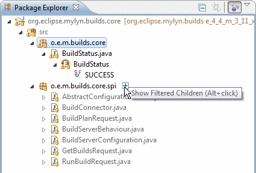
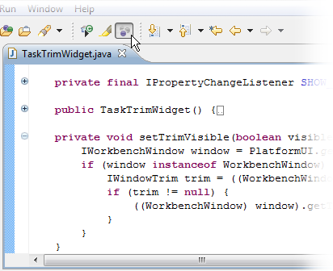
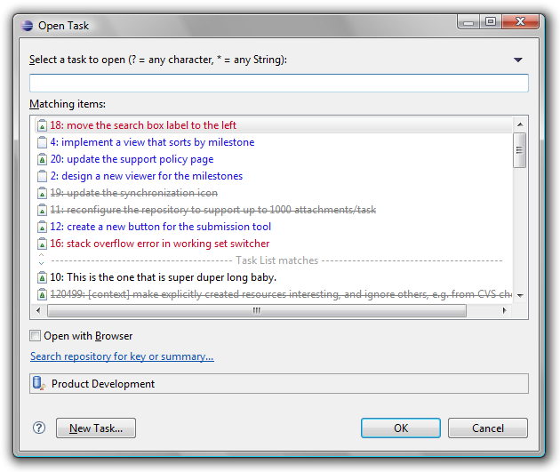
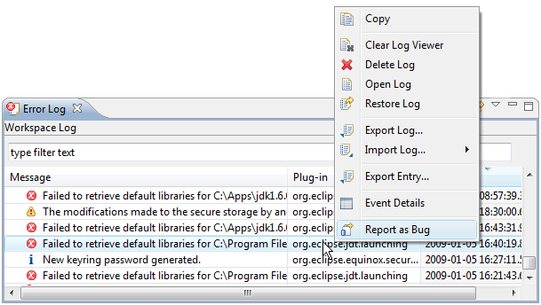

Task-Focused Interface  
   
Task Editor Team Support  
  
* * *

# Task-Focused Interface

The task-focused interface is oriented around tasks and offers several ways to focus the interface on only what is relevant for the currently active task.

## Focusing Navigator Views

You can focus navigator views (e.g. Package Explorer, Project Explorer, Navigator) by toggling the "Focus on Active Task" button in the toolbar. When focused, the view will show only the resources that are "interesting" for the currently active task.

## Alt+Click Navigation / Show Filtered Children

To navigate to a new resource that is not a part of the active task's context, you can toggle "Focus on Active Task" off, browse to the resource, and then click "Focus on Active Task" again to see only relevant resources. A more efficient way to add new resources is to use Alt+Click navigation (clicking the mouse while holding the Alt key) or click the [+] icon that appears to the right of a tree node when the mouse hovers over it.

When a view is in Focused mode, you can click the [+] icon to the right of a node, or Alt+Click the node, to temporarily show all of its children. 

  * Once an element that was previously not interesting is selected with the mouse, it becomes interesting and the other child elements will disappear. The clicked element is now a part of the task's context.
  * You can drill down multiple levels of filtered nodes by clicking the [+] icon to the right of each node you want to unfilter. Note that trying to expand the node in other ways (e.g. clicking the triangle to the left of the node) will not show its filtered children - clicking anywhere in the view (other than a [+] icon) will hide all filtered children again.
  * Alt can be held down while clicking to drill down from a top-level element to a deeply nested element that is to be added to the task context.
  * Multiple Alt+Clicks are supported so that you can add several elements to the task context. As soon as a normal click is made, uninteresting elements will disappear.
  * Ctrl+Clicks (i.e. disjoint selections, use Command key on Mac) are also supported and will cause each element clicked to become interesting. The first normal click will cause uninteresting elements to disappear. Note that Ctrl+clicked elements will become interesting (turn from gray to black) but only the most recently-clicked one will be selected while Alt is held down.

## Focusing Editors

Some editors such as the Java editor support focusing. Clicking the Focus button in the toolbar will fold all declarations that are not part of the active task context.

## Task-focused Ordering

When a task is active, elements that are interesting are displayed more prominently. For example, when you open the Java Open Type dialog (Ctrl+Shift+T), types that are interesting for the active task are shown first. Similarly, when you use ctrl+space to autocomplete a method name in a Java source file, methods that are in the task context are displayed at the top.

## Working Set Integration

When Focus is applied to a navigator view, the working sets filter for that navigator view will be disabled. This ensures that you see all interesting elements when working on a task that spans working sets. To enforce visibility of only elements within one working set, do the following:

  * Set the view to show working sets as top-level elements.
  * Use the _Go Into_ action on the popup menu of the working set node in the view to scope the view down to just the working set. 

## Open Task dialog

An _Open Type_ style dialog is available for opening tasks (`Ctrl+F12`) and for activating tasks (`Ctrl+F9`). The list is initially populated by recently active tasks. The active task can also be deactivated via `Ctrl+Shift+F9`. This can be used as a keyboard-only alternative for multi-tasking without the _Task List_ view visible. These actions appear in the _Navigate_ menu. 

## Task Hyperlinking

In the task editor, comments that include text of the form bug#123 or task#123 or bug 123 will be hyperlinked. Ctrl+clicking on this text will open the task or bug in the rich task editor.

To support hyperlinks within other text editors such as code or .txt files, the project that contains the file must be associated with a particular task repository. This is configured by right-clicking on the project and navigating to "Properties" > "Task Repository" and selecting the task repository used when working with this project.

## Reporting Bugs from the Error Log

Bugs can created directly from events in the _Error Log_ view. This will create a new repository task editor with the summary and description populated with the error event's details. If the Connector you are using does not have a rich editor, the event details will be placed into the clipboard so that you can paste them into the web-based editor that will be opened automatically. 

* * *

    
Task Editor Team Support
