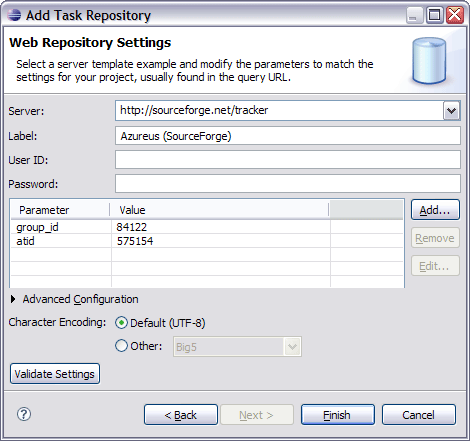

Task Repository Connectors  
   
Preferences Updating This Document  
  
* * *

# Task Repository Connectors

Mylyn allows you to collaborate on tasks via a shared task repository, also known as bug tracking systems. In order to collaborate, you need to have a **Connector** to your particular repository. 

See [Mylyn Extensions](<http://wiki.eclipse.org/Mylyn/Extensions> "Mylyn/Extensions") for a list of available connectors. 

## Bugzilla Connector

  * See the [Bugzilla Connector](<http://wiki.eclipse.org/Mylyn/Bugzilla_Connector> "Mylyn/Bugzilla_Connector") wiki page. 
  * See [Bugzilla Connector Troubleshooting](<../../Mylyn/FAQ/Bugzilla-Connector.md#Bugzilla_Connector> "Mylyn/FAQ#Bugzilla_Connector"). 

## Trac Connector

See [Trac Connector Troubleshooting](<../../Mylyn/FAQ/Trac-Connector.md#Trac_Connector> "Mylyn/FAQ#Trac_Connector"). 

## Generic Web Templates Connector

The generic web repository connector is NOT part of the default Mylyn install. You can install it from the incubator update site. See the [Mylyn download page](<http://www.eclipse.org/mylyn/downloads/>) for more details. 

The web connector allow to retrieve tasks from repositories that don't have rich connectors, but can show list of tasks on the web UI. Out of the box connector provides configuration templates for the following issue tracking systems:

  * Google Code Hosting (`code.google.com`)
  * IssueZilla (`java.net, dev2dev, tigris.org`)
  * GForge (`objectweb.org`)
  * SourceForge (`sf.net`), see [Using Sourceforge with Mylyn](<http://wiki.eclipse.org/Using_Sourceforge_with_Mylyn> "Using Sourceforge with Mylyn")
  * Mantis (`www.futureware.biz/mantis`)
  * ChangeLogic (`changelogic.araneaframework.org`)
  * OTRS (`otrs.org`)
  * phpBB
  * vBulletin

Lists of issues can be extracted from existing web pages using simple parsing configuration. Configuration can be also parametrized to make it easier to customize it for a specific project.

The parameters used for configuring project properties are typically substituted into the URLs used to access the repository. Substitution and matching rules can be edited under the _Advanced Configuration_ section on both the _Repository Settings_ page and the _Edit Query_ page. 

See [FAQ](<../../Mylyn/FAQ/Web-Templates-Connector.md#Web_Templates_Connector> "Mylyn/FAQ#Web_Templates_Connector") for the troubleshooting tips. 

**For example** , consider the configuration steps for GlassFish project at `java.net`: 

**1.** Create new Generic web-based repository (in the Task Repository view). GlassFish is using IssueZilla and has a preconfigured template that can be selected by server url _<https://glassfish.dev.java.net/issues> _. You can also specify all fields manually in the _Advanced Configuration_ section. For GlassFish the following settings are required: 

  * Task URL: `${serverUrl}/show_bug.cgi?id=`
  * New Task URL: `${serverUrl}/enter_bug.cgi?issue_type=DEFECT`
  * Query URL: `${serverUrl}/buglist.cgi?component=glassfish&issue_status=NEW&issue_status=STARTED&issue_status=REOPENED&order=Issue+Number`
  * Query Pattern: `<a href="show_bug.cgi\?id\=(.+?)">.+?(.+?)`

     **Note:** _Query Pattern_ field should be a `regexp` with 1st matching group on _Issue ID_ and 2nd on _Issue Description_. Alternatively, you could use named matching groups: ({Id}.+?), ({Description}.+?), ({Status}.+?), ({Owner}.+?) and ({Type}.+?), then they can appear in query `regexp` in an arbitrary order. The second option requires build 2.0.0v20070717 or later. 

     **Note:** the above fields are using parameter substitution `${..}`. Variables `serverUrl, userId` and `password` are substituted from the values of corresponding fields of the repository preference page. In addition you can specify any arbitrary parameters and their values that will be also substituted into the template fields. 

     **Note:** the SourceForge template included with connector assume that _single repository is used for all projects_. User should create multiple queries, and set project parameters at the query level. Because web connector don't support actions like "open repository task" there is really no need to create separate repositories per project and if you think about it that is how it work for connectors for Bugzilla and Trac. However, it is still possible to setup separate repository per project using repository url like http://sourceforge.net/tracker/?group_id=172199 and accordingly updating derived urls is the advanced repository settings. 

**For the web repository that require user to login, use advanced configuration in following way.** _This configuration is for GForge, you might need to change it for other repositories_ : 

  * Login Request URL - an address that form is using to submit login request: `${serverUrl}/account/login.php?return_to=&form_loginname=${userId}&form_pw=${password}&login=Login **(POST)**`
  * Login Form URL - an address where login form is located _(only needed if server need a login token in the parameters of the Login Request URL)_ : `${serverUrl}/account/login.php`
  * Login Token Pattern - pattern to extract value of the `loginToken` parameter from the form page _(only needed if server need a login token in the parameters of the Login Request URL and Login Form URL is specified)_ : `session_ser=(.+?)`

**2.** Create a new query for the GlassFish task repository created above (either from popup context menu in the Task List view or using a "New..." wizard from File -> New... -> Other... menu). 

  * _Query URL_ and _Query Pattern_ in the _Repository Preferences_ are used as default query parameters and can be overwritten in _Advanced Configuration_ section in _Query Preferences_. Custom parameter values can also be overridden here as well as new parameters for substitution into the specific query. 

  * In the _Advanced Configuration_ section of the "New Query" dialog, there is a "Preview" button. You can use it to test your query pattern. 

[Category:Draft Documentation](<http://wiki.eclipse.org/Category:Draft_Documentation> "Category:Draft Documentation")

* * *

    
Preferences Updating This Document
