Mylyn User Guide  
  
Task Repositories  
  
* * *

# Task List

Use the Task List to view and manage your tasks. If the task list view is not visible, you can open it by navigating to Window -> Show View -> Other... -> Mylyn -> Task List. The Task List contains both "Local Tasks" and shared repository tasks that are stored in a task repository such as Bugzilla or Trac. Local tasks are typically contained in categories, which you can create by right-clicking on the task list and selecting New -> Category. Repository tasks are contained in special categories that represent queries.

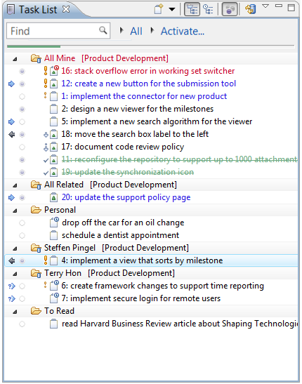

At the top of the Task List, you will find the following buttons and features:

  * **New Task** \- Create a new local or repository task. 
  * **Synchronize** \- Update repository tasks with changes from the server. 
  * **Task Presentation** \- Toggle between Scheduled and Categorized presentations. 
  * **Focus on Workweek** \- See only tasks scheduled for this week. 
  * **Find** \- search for a task by typing in words from the task summary, or specify specific fields to query. See Finding Tasks for details. 
  * **Working set indicator** \- Indicates the currently active working set. Use the black arrow on the left to change the working set. 
  * **Current task indicator** \- Indicates the currently active task. Use the black arrow on the left to re-activate a recently active task. 

## Finding Tasks

The task list can be filtered by providing a phrase to match against the task summary. The phrase must appear in the summary of a task for the task to be visible when a filter is applied. The task list filter operates by searching on a locally-maintained index of the tasks in your task list. (In rare cases, it may be necessary to manually refresh the search index by selecting "Refresh Search Index" from the task list menu.)

  * Search for task summary or task id by entering the value. For example, `NullPointerException` or `12345`.
  * Search for other task fields such as description or assignee by prefixing them with the field name. For example `description:NullPointerException` will search in the task description rather than the summary. Content assist can be used to provide a list of common field names, and will provide a list of known user names when searching on user fields. 

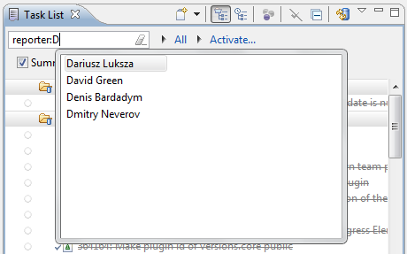

  * Search for date ranges by qualifying the range. For example, show tasks that were created in the `(past week)`.

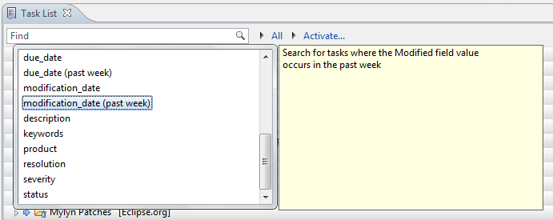

  * Search for an exact phrase by enclosing it in double-quotes. For example, `description:"user experience"`.
  * Search for partial words by using the "*" wildcard. For example, `exc*tion` matches both "exclamation" and "exception".

### Available Fields

Available fields can be found by using content assist in the search field. The following fields are available for search with most repositories:

content
    match against any of summary, description, comments and other long text fields
summary
    the task summary
description
    match against the task description
person
    match against any person field, such as reporter, assignee, watcher, etc.
task_key
    match against the task or bug id
attachment
    match against attachment names
assignee
    match against the assignee of the task
reporter
    match against the reporter of the task
product
    match against the product of the task
component
    match against the component of the task
creation_date
    match against the date when the task was created
completion_date
    match against the date when the task was completed
due_date
    match against the date when the task is due
modification_date
    match against the date when the task was last modified
status
    match against the status
resolution
    match against the resolution
severity
    match against the severity

Some fields listed above may not be available depending on the repository and connector.

### Search Operators

The Task List provides logical operators. For example, `NPE AND Display`. Note that unlike other search phrases, **search operators are case-sensitive** ; otherwise, the words are treated as part of the search phrase. 

AND
    Searches for tasks that contain both words.
OR
    Searches for tasks that contain at least one word.

## Task List Presentation

The task list supports several ways to present tasks. You can toggle between the following modes by using the "Task Presentation" button in the toolbar.

  * **Categorized** \- View tasks grouped by their category 

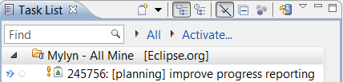

  * **Scheduled** \- View tasks grouped by the " _scheduled_ date" 

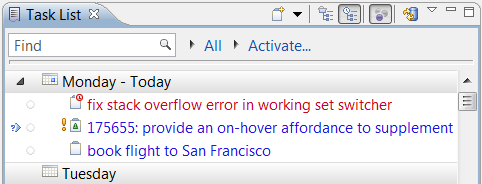

In either presentation, you can toggle the "Focus on Workweek" button. In this mode, only the following tasks will be visible:

  * Tasks scheduled for this week.
  * Overdue tasks.
  * Tasks with unread changes from your task repository.

## Icon Legend and Color Coding

See the legend below to interpret the icons and color coding in the task list. You can view this legend by selecting "Show UI Legend" from the menu that appears when you click the white down arrow next to the minimize button in the top right corner of the Task List view. 

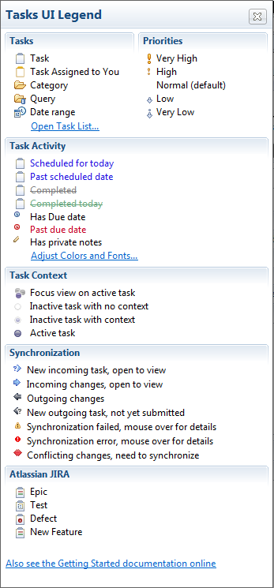

## Creating New Tasks

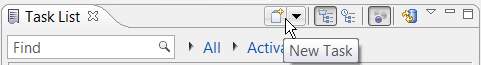

You can create new tasks by clicking on the "New Task" button in the Task List's toolbar. This will open the "New Task" dialog and prompt you to select a repository. There are two main types of tasks, local tasks and repository tasks.

### Local Tasks

Use local tasks if you do not have a shared task repository or if you would like to create a private, personal task that is local to your workspace. To create a local task, select **Local Task** and "Finish" from the New Task dialog. 

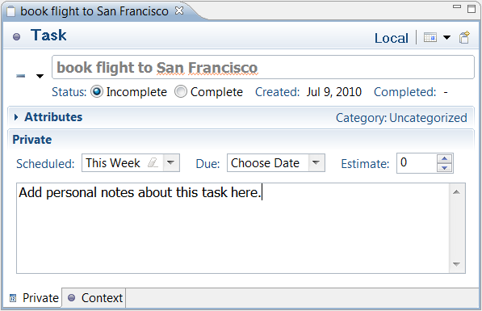

You can then provide the following details about the task.

  * '''Task Description - Your task is called "New Task" by default. Replace this with a brief task description.
  * **Priority** \- Set the priority of your task. This will affect the task's icon and order in the task list. 
  * **Status** \- Set your task to "complete" or "incomplete". In your task list, completed tasks have a strikethrough font and will appear lower in the list. 
  * **URL** \- You can associate a URL with this task. 
    * "Retrieve Task Description from URL" button - Set the task description to the title of the associated URL (page)
    * "Open with Web Browser" button - Open the URL in the integrated web browser
  * **Scheduled For** \- Set the date when you will work on this task. Tasks scheduled for today or a date in the past will appear in blue in your task list. Tasks scheduled for future days will appear in black. If your task list is in focused mode, only tasks for the current week will be visible (unless they have unread changes). 
  * **Due** \- Set the date when your task must be completed. Overdue tasks and tasks due today will appear in red in your task list. 
  * **Estimated Hours** \- Estimate the number of hours it will take to complete this task. 
  * **Active** \- Displays the total time that you have worked on this task. Time is only recorded when this task is active and you are actively interacting with the system. 
  * **Notes** \- Record your personal notes about this task. 

### Repository Tasks

Create a new repository task when you would like to share information about the task with your team using a task repository such as Bugzilla or Trac. To create a new repository task, click on the "New Task" button in the Task List's toolbar. You can then select the repository where you would like to create a task. If you don't see your team's task repository, you will need to configure it in the task repositories view. Once you have selected a repository, click "Next". If you are connecting to a Bugzilla repository, select a "Product" as a top-level category for your task and click "Finish".

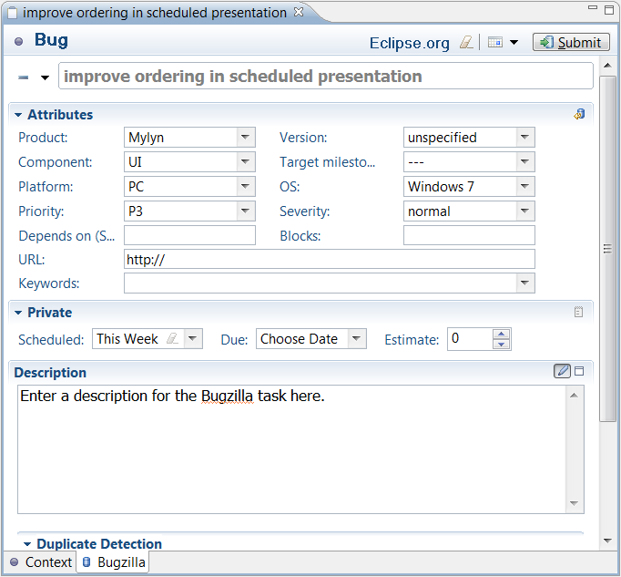

A new task editor will appear. If you are using Bugzilla, you can enter the following information:

Required

  * **Description** \- Enter a brief task description in the text box at the top (this box does not have a label). 
  * **Component** \- Specify a "Component" to further categorize this task within the previously selected "Product". 
  * **Description** \- Describe the task in detail. 

Optional

  * You can specify additional information about your tasks in the "Attributes" section.
  * **Personal Planning** \- You can enter information in this section that will be local to your workspace and **not** available on your team's task repository. See "Local Tasks" for more information about the personal planning fields. 
  * **Assigned to** \- Specify who should work on the task. Type the first several characters of the person's email address, and then press ctrl+space to select the address from a list. A task can be assigned to only one person at a time. 
  * **Add CC** \- Add the addresses of people who should be notified of changes to this task. You can add multiple addresses, separated by a comma, e.g. (mik.kersten@tasktop.com, steffen.pingel@tasktop.com). 

When finished, click "Submit" to add your new task to your team's shared task repository.

## Creating new Queries

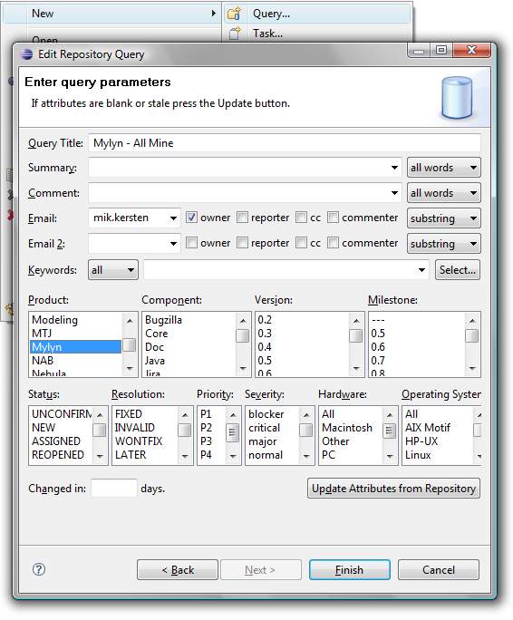

Once you have configured your team's task repository, you can use Queries to add tasks to your task list.

  * If the Task List is not visible, navigate to _Window - > Show View -> Other -> Mylyn -> Task List_
  * Right-click on the Task List and select "New -> Query..."
  * Select the repository whose tasks you would like to download and click "Next".
  * If you are prompted to select a query type, select "Create query using form" and click "Next".
  * Complete the form to define which tasks will be downloaded as part of this query, and then click "Finish". You can provide values for only as many parameters as necessary to filter the query results.

If you are using the Bugzilla connector, you can specify the following parameters by default. The parameters for most other connectors will be similar.

  * **Query Title** \- Label that appears in your task list. 
  * **Summary** \- Specify words that must appear in the summary of tasks matched by this query. 
  * **Comment** \- Words that must appear in the comments of matching tasks. 
  * **Email** \- Specify all or part of an email address. This address is used together with the following options: 
    * **Owner** \- The specified email must match the person who the task is assigned to 
    * **Reporter** \- The specified email must match the person who created the task 
    * **CC** \- The person with the specified email address must be CC'd on the task 
    * **Commenter** \- The person with the specified email address must have commented on the task 
    * You can choose from the following options to specify how the email address will be matched: 
      * **substring** \- Only a part of the specified address must match 
      * **exact** \- The specified email address must match exactly 
      * **regexp** \- The email address must match the specified regular expression 
      * **notregexp** \- The email address must NOT match the specified regular expression 
  * **Email 2** \- You can use this parameter to specify another email address to further restrict the results 
  * **Keywords** \- Click the "Select..." button to specify a keyword that must be associated with matching tasks 
  * **Product, Component, Version, ...** \- Optionally select parameters to restrict the results to a particular product, version, etc. 
  * **Update Attributes from Repository** \- Click this to refresh the available parameters if the project structure on the task respository has changed recently. 
  * **Changed in:** \- Only tasks modified within the specified number of days will appear in the query results 

## Scheduling

Two kinds of dates for scheduling are provided.

**Scheduled Date**

  * A soft date used for personal scheduling that can be easily deferred as priorities change. The scheduled date is the date you plan to start working on the task.
  * When a task reaches its scheduled date it will turn blue, indicating that the task should be activated and worked on today.
  * Scheduled dates are private to your local workspace

**Due Date**

  * A hard date when the task must be completed. This is often related to external constraints such as deadlines.
  * If you are using a shared task repository, due dates become an attribute of the shared task and will be visible to other team members.
  * A task with a due date has a small clock overlay that is blue before the due date and red after.

## Synchronization

Repository tasks and queries are synchronized to reflect the latest changes on the server. Tasks are synchronized the following ways:

  * **Automatic Synchronization.** By default, tasks will be synchronized with the repository every 20 minutes. Automatic synchronization can be disabled via the _Synchronize Automatically_ option in the view menu (e.g. when working with intermittently available connectivity). The synchronization interval can be changed via _Preferences - > Mylyn -> Task List_. 

  * **On Task Open.** Tasks are synchronized automatically in the background when a task editor is opened. 

  * **Manually.** Individual tasks and queries can be synchronized manually by right-clicking on them in the Task List and selecting "Synchronize", or via the toolbar button. Clicking the toolbar button will synchronize all queries in your task list. 

  
**Disconnected Mode**   
A task repository can be put into Disconnected mode via the right-click menu in the _Task Repositories_ view. This can be useful if the task repository is not currently in use (e.g. you are no longer engaged with the project, or the repository is no longer available). The offline support will ensure that you can still access tasks that you have worked with via their offline copies, and the Disconnected mode will ensure that synchronization warnings do not appear. Note that it is not necessary to turn off synchronization or work in Disconnected Mode when working offline. 

## Incoming Changes

A blue arrow to the left of a task indicates that the task has changed in the shared repository. Double-click the task to view it in the task editor. Changes to the task will be highlighted in blue.

To quickly review the differences since the task was last read, hover over the task in the Task List to view a summary in a tooltip. You can also press F4 to display a tooltip. You may also wish to view the task list in "Focus on Workweek" mode, which will filter out tasks without incoming changes that are not scheduled or due this week. You can toggle "Focus on Workweek" using a button in the Task List's toolbar.

## Reviewing Tasks

The task list has been carefully designed to support quickly reviewing tasks. Task reviewing is best done by configuring a query to show the tasks that you want to review. Once the tasks are displayed in the Task List they can be reviewed one at a time by scrolling through them using the keyboard up/down arrows. The task tooltip should provide enough detail to do a review and will display information relevant to the currently selected task. 

To edit the selected task press the enter key, use Ctrl+Enter to open the task in the background. To quickly jump to the next unread task hold down the Alt-key when pressing up or down. To mark a task as read while navigating use Alt+shift+up/down. When reviewing tasks in this way, it is best to avoid mouse-based and gesture-based scrolling.

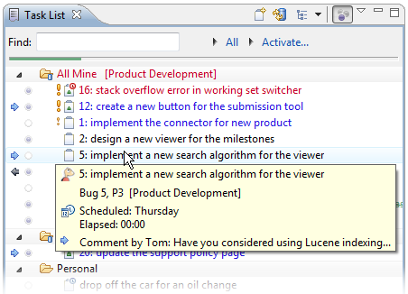

## Task Progress Indicators

**Weekly progress**   
When in _Focus on Workweek_ mode (right-most toolbar button), the Task List will show a progress bar that indicates progress on the tasks scheduled for the current week. Each task that is scheduled for the week but not yet completed adds to the bar. A task completed by you adds to the green progress in the bar. Deferring a task to a future week will also add to the apparent progress because it will remove the task from the current week. Mousing over the bar will indicate details about your progress, such as the number of tasks and hours completed. To avoid the need for manual estimation by default every task is estimated for 1 hour, but if you have longer or shorter running tasks that week you can adjust the estimate in the task editor's _Planning_ page to ensure that the progress bar is accurate. 

Note that when in _Focus on Workweek_ mode the _Task List_ will show each of the tasks scheduled for this week. However, overdue tasks and those with incoming changes will also show, making the number of tasks visible not be a reliable indicator of progress on the tasks planned for the week. 

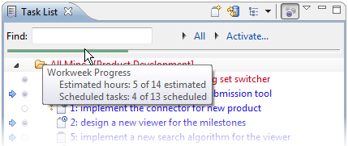

  
**Category Progress**   
You can hover over categories in the task list to display a tooltip that displays a summary of complete and incomplete tasks. 

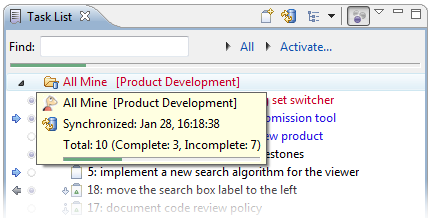

## Task List Settings and Operations

Click the small white arrow in the top right of the Task List view to access the following settings:

  * **Go Up to Root** \- Return to the normal presentation after previously selecting "Go Into" to see only the tasks in a particular category. 
  * **Sort** \- Open a dialog to set the sort order for the task list. This option is only available when the task list is not in "Focus on Workweek" mode. 
  * **Filter priority lower than** \- Hide tasks with a priority less than the priority you select. This option is only availabe when the task list is not in "Focus on Workweek" mode. 
  * **Filter completed tasks** \- Hide local and repository tasks that are in a completed state. 
  * **Search Repository** \- Opens a dialog to search for repository tasks. Search results will appear in a separate search results view. 
  * **Restore Tasks from History** \- Opens a dialog for restoring lost tasks. 
  * **Synchronize Changed** \- Updates the task list with any changes on the task repository. 
  * **Synchronize Automatically** \- When checked, the task list will update from the task repository on an interval specified in Window -> Preferences -> Mylyn -> Tasks 
  * **Show UI Legend** \- Displays a legend explaining icons and color-coding. 
  * **Focus on Workweek** \- Displays only tasks that are scheduled for this week, overdue, or have unread changes. 
  * **Link with Editor** \- Automatically selects the task corresponding to the active task editor. 
  * **Preferences** \- Access additional Task List preferences. 

  
Right-clicking in the task list provides access to the following operations 

  * **New...** \- Create new categories, queries, and tasks. 
  * **Open with Browser** \- Open the task in a web browser tab rather than the rich editor. 
  * **Schedule for** \- Set the soft date when you intend to work on the task. 
  * **Mark as** \- Mark a task as read or unread as you would an email message. 
  * **Copy Details** \- Places the task summary and html link in the clipboard so you can paste it into an email, document, etc. 
  * **Delete** \- Deletes local tasks. For repository tasks, the all downloaded data and local task information will be cleared but the task will re-appear if it still matches a query. 
  * **Rename** \- Rename a task. 
  * **Go into** (queries only) - Show only the tasks in the selected category. 
  * **Import and Export** \- Access functionality for importing and exporting task data. 
  * **Repository** (queries only) - Update repository settings 
  * **Synchronize** \- Update the selected tasks or queries from the shared task repository 
  * **Properties** \- Edit the settings for a repository query 

* * *

  
Task Repositories
