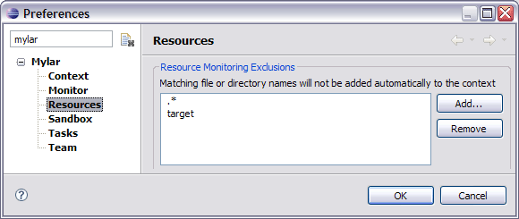

Integration with other tools  
   
WikiText Misc  
  
* * *

# Integration with other tools

See the **[Mylyn Extensions](<http://wiki.eclipse.org/Mylyn/Extensions> "Mylyn/Extensions") ** page for a listing of integration downloads. 

Mylyn relies on [Bridges](<http://wiki.eclipse.org/Mylyn/Architecture> "Mylyn/Architecture") to integrate the context model with the structure and UI features of domain-specific tools. To create a Bridge, see [Creating Bridges](<http://wiki.eclipse.org/Mylyn/Integrator_Reference#Creating_Bridges> "Mylyn/Integrator_Reference#Creating_Bridges"). 

The core set of Bridges supports the Eclipse SDK (i.e. has bridges for Java, JUnit, PDE, Ant and Resources). The Resources Bridge enables a basic level of interoperability with other tools that use files (e.g. `.php, .cpp`), and enables Mylyn filtering to work for generic views that show those files (i.e. the _Project Explorer_ , _Navigator_) and any corresponding markers (i.e. the _Problems_ and _Tasks_ views). This is only the most basic context model integration, and does not offer the benefits of a specialized structure bridge, such as making declarations part of the context and providing _Active Search_ facilities. Without a Bridge Mylyn cannot be applied to tool-specific views. 

**If you would like to see support for a particular tool** , first do a search of the open bridge requests and [vote for the corresponding bug](<https://bugs.eclipse.org/bugs/buglist.cgi?query_format=advanced&short_desc_type=anywordssubstr&short_desc=%5Bbridge%5D&product=Mylyn&long_desc_type=allwordssubstr&long_desc=&bug_file_loc_type=allwordssubstr&bug_file_loc=&status_whiteboard_type=allwordssubstr&status_whiteboard=&keywords_type=allwords&keywords=&bug_status=NEW&bug_status=ASSIGNED&bug_status=REOPENED&emailtype1=substring&email1=&emailtype2=substring&email2=&bugidtype=include&bug_id=&votes=&chfieldfrom=&chfieldto=Now&chfieldvalue=&cmdtype=doit&order=Reuse+same+sort+as+last+time&field0-0-0=noop&type0-0-0=noop&value0-0-0=>) if your tool is there, or [create a new bug](<http://www.eclipse.org/mylyn/bugs.php>). Also consider adding your experiences to the "Integration..." section of the Mylyn FAQ. 

## Using Mylyn with WTP

Context modeling works at the file level, noting the limitation of [bug 144882: interest filter fails on WTP Dynamic Web Project](<https://bugs.eclipse.org/bugs/show_bug.cgi?id=144882>)

## External builders

If an external builder (e.g. Maven, pydev, or other Ant-based builders) is producing output files that are being automatically added to your context because they are not being marked "derived" as with Eclipse-based builders. You may note that such files are always show as interesting when they are generated or updated and can not be filtered away, since Mylyn expects all files that have changed as part of the task context to have interest.

In this case you can explicitly exclude these files from being added to the task context the _Preferences - > Mylyn -> Resources_ page. For example, if the output folder of the builder is "target", you could set this the following way. Similarly, you could add a filter for "*.pyc" to exclude all files generated with that extension. 

Source code generators can be considered analogous since they produce intermediate files. However, if you want to inspect the results of the source code generation after it is done you can avoid setting the exclusion. Note that if a large number of files was generated not all generated files may be unfiltered.

* * *

    
WikiText Misc
