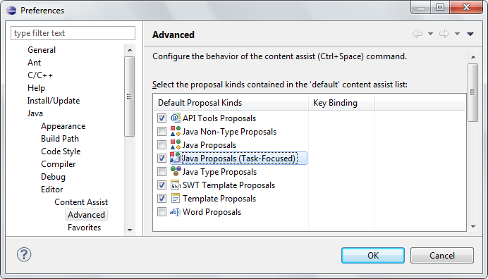
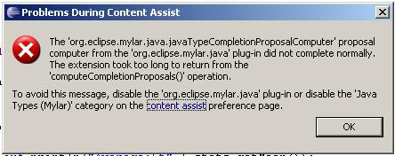
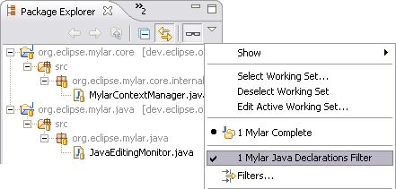

Java Development  
   
Context and Timing data Team Support  
  
* * *

# Java Development

## Content assist troubleshooting

Mylyn uses custom Content Assist processors in order to rank and separate elements in the current task context. To see proposals ranked according to interest you must have the _Java Proposals (Task-Focused)_ checkbox enabled in the list below and other Java proposals unchecked, otherwise you will see duplicates. 

**If you do not see any proposals, check this list** to ensure that either the Mylyn or the plain proposals are enabled. You always recover by disabling Mylyn's content assist through pressing "Reset Defaults" in the preferences under Window → Preferences → Java → Editor → Content Assist → Advanced. 

**Why do I see duplicate proposals?**

Ensure that you have only the _Task-Focused_ proposals kinds enabled in _Window → Preferences → Java → Editor → Content Assist → Advanced_ , otherwise you will see duplicates. 

If you use proposals via Ctrl+Shift+Space instead of the typical Ctrl+Space you will see duplicates. Vote for JDT/Text [bug 147781](<https://bugs.eclipse.org/bugs/show_bug.cgi?id=147781>) if you use this mechanism. Also see: [bug 129080](<https://bugs.eclipse.org/bugs/show_bug.cgi?id=129080>)

**Why do I get an error message when using content assist?**

If after invoking Content Assist you see an error message dialog that states:
    
    
    The extension took too long to return from the 'computeCompletionProposals()' operation
    

this is most likely due to something interrupting the proposal operation (e.g. garbage collection). Ignore it if it does not recur, increase Eclipse’s memory if it does (e.g via `-Xmx384M` command line argument). See [bug 141457](<https://bugs.eclipse.org/bugs/show_bug.cgi?id=141457>) for more details. 

Note that Mylyn should only add a trivial amount of overhead to content assist computation, however, the standard content assist mechanism will not report timeouts of this sort (i.e. taking longer than 5s to compute proposals). If the system that you are working on is so large that increasing memeory does not reduce the timings to avoid the message, you could also consider disabling the Mylyn-specific content assist, as described above, but if doing so please comment on [bug 141457](<https://bugs.eclipse.org/bugs/show_bug.cgi?id=141457>). 

## Why do interesting elements not show in the Project Explorer?

The _Package Presentation → Hierarchical_ mode is not supported on the _Project Explorer_ view in Eclipse 3.2 through 3.3M3 and possibly later versions [bug 161362](<https://bugs.eclipse.org/bugs/show_bug.cgi?id=161362>). Use the view menu to set _Package Presentation → Flat_ as a work-around. 

## How do I stop declarations from showing in the Package Explorer?

If you don’t like Mylyn’s constant showing of Java members in the _Package Explorer_ , select the drop-down menu, then _Filters…_ and enable the _Mylyn Java Declarations Filter_. It will then stick in the menu in case you want to toggle between modes. 

Note that this will hide interest information about members that aren’t in your current file (e.g. showing you which methods are landmarks). This means that you will need to commit those methods to memeory, and the next time that you start working on the task you will have the burden of figuring out what they are. On smaller screen resolutions this mode can be useful, but also consider turning the Package Explorer into a fast view.

## Why does nothing show up in the Active Search or Active Hierarchy?

As you work, elements become Landmarks (bold decoration), and these elements populate the _Active Search_ and _Active Hierarchy_ views. To force an element to populate the views manually, make it a Landmark by `right+clicking` or hitting `Ctrl+Alt+Shift+UpArrow`. 

## Known limitations

  * [Bug 106678](<https://bugs.eclipse.org/bugs/show_bug.cgi?id=106678>): The Project Explorer’s Hierarchical Java package presentation layout is not supported on Eclipse 3.3Mx, and interesting elements will be hidden if enabled. Work-around is to use the default Flat package presentation. 

* * *

    
Context and Timing data Team Support
