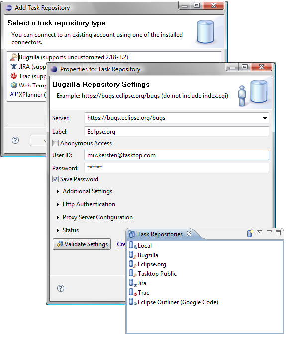

Task Repositories  
   
Mylyn User Guide Task Editor  
  
* * *

# Task Repositories

Use the Task Repositories view to configure Mylyn to connect to your team's shared task repository (bug or issue tracker):

  * Open the task repositories view by navigating to _Window - > Show View -> Other -> Mylyn -> Task Repositories_
  * Click the "Add Task Repository" button located in the view's toolbar.
  * Select the type of repository you wish to connect to and click "Next". If you don't see your repository type, you will need to install the appropriate connector.
  * Enter the repository's address and your login credentials. After filling in these details, press the _Validate_ button to ensure the repository exists and your login credentials are valid. Once the settings validate, Click Finish. Note that the settings will vary somewhat depending on the type of repository that you are connecting to. The screenshot shows the settings fore connecting to a Bugzilla repository. 
  * You should now see the new repository in the _Task Repositories_ view. 
  * Now that you have created a repository, you may add queries to the Task List.

* * *

    
Mylyn User Guide Task Editor
