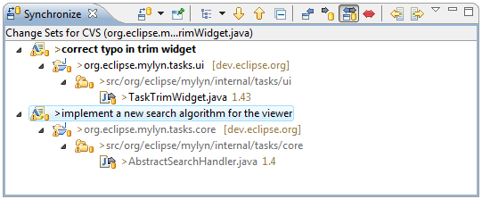
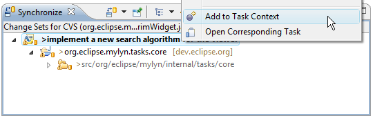

Team Support  
   
Task-Focused Interface Shortcuts  
  
* * *

# Team Support

The task-focused interface provides several ways to improve your work flow when working with a source code repository such as CVS or Subversion. CVS support is available out-of-the-box and task-focused interface integration for Subversion is available via the Subclipse or Subversive plugins.

## Task-focused Change Sets

When working with a source code repository, you can commit or update only the resources that are in the context of a particular task. This helps you work on several tasks concurrently and avoid polluting your workspace with changes that are not relevant to the current task.

To enable this functionality, locate the "Synchronize" view. If the view is not visible, you can open it by navigating to Window -> Show View -> Other... -> Team -> Synchronize. Next, click the small black arrow next to "Show File System Resources" in the Synchronize view toolbar and select "Change Sets". Note that change sets are not currently supported in the EGit connector.

You can now synchronize resources in your workspace as usual (e.g. by right-clicking on a resource in the navigator and selecting "Team" -> "Synchronize with Repository". Your resources will now be grouped by change sets corresponding to tasks. Expanding the task shows individual resources. Changed resources that are not a part of any task context will appear under the root of the Synchronize view. If needed missing resources can be added to the task context Change Set via the Synchronize View by right+clicking the resource and selecting "Add to" and then selecting the corresponding task. Select "no set" to remove a resource from a change set.

You can use buttons in the toolbar of the Synchronize view to change modes as follows:

  * **Incoming Mode** \- See only updates to be retrieved from the server 
  * **Outgoing Mode** \- See only your local changes to be committed to the server 
  * **Incoming/Outgoing Mode** \- See both incoming and outgoing changes 

Right-clicking a Change Set provides access to the following operations:

  * **Add to Task Context** \- Adds all changed files to the active task context, see Working with Patches for more information 
  * **Open Corresponding Task** \- Opens the task associated with the Change Set in the Task Editor 

## Automatic Commit Messages

When using task-focused change sets as described above, commit messages are automatically be generated based on the task whose resources are being commited. By default, the commit message includes information such as the task ID, description, and URL. To change the template for these commit messages, navigate to Window -> Preferences -> Mylyn -> Team.

Note that for EGit, Task-focused Change Sets are not supported, however the commit message will be populated based on your currently active task.

## Working with Patches

When applying patches, the preferred scenario is to have a task context attached to the task along with the patch. Since this is not always feasible, Mylyn provides an action in the popup menu of the _Synchronize_ view that supports adding changed elements to the task context. 

  1. Activate the task containing the patch.
  2. Apply the patch. If you are using automatic change sets, this will cause the change set created by Mylyn to contain the outoing changes. If it doesn't you can use the _Add to_ action on the popup menu to add the elements to the corresponding change set. 
  3. Invoke the _Add to Task Context_ action on the change set node, causing all of the changed files to be added to the task context. You can also invoke this action on a selection one or more elements (e.g. files) in the view. 

* * *

    
Task-Focused Interface Shortcuts
