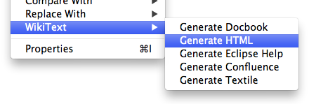

Markup Generation  
  
Task Editor IntegrationTextile Syntax  
  
* * *

# Markup Generation

Lightweight markup (wikitext) is designed to be readily converted to HTML. WikiText provides a means to generate HTML and these output formats:

  * HTML
  * [DocBook](<http://www.docbook.org>)
  * [OASIS DITA](<http://dita.xml.org>)
  * Eclipse help format (HTML and `toc.xml`)
  * [XSL-FO](<http://en.wikipedia.org/wiki/XSL_Formatting_Objects>)
  * Other markup languages (e.g. Textile, Confluence, Markdown, AsciiDoc)

## Generation In Eclipse

These conversions can be made by right-clicking any `*.textile`, `*.tracwiki`, `*.mediawiki`, `*.twiki`, or `*.confluence` resource in the Eclipse UI:

Performing a conversion from the UI will cause corresponding files (`*.xml`, `*.html`, `*-toc.xml`, `*.textile`) to be created in the same folder as the selected file(s).

More control over the conversion process can be achieved by using Ant build scripts (described below).

### Content Generation from Wiki Markup

Mylyn WikiText can convert from one wiki markup language to another. Currently supported output formats are Textile, Confluence, Markdown, AsciiDoc. Examples of conversions include MediaWiki to Textile, Confluence to Textile, MediaWiki to Confluence, etc.

Wiki markup conversion is performed in Eclipse, see Conversion In Eclipse for more details.

## Content Generation from Wiki Markup using Maven

A Maven plug-in is provided that can generate HTML and Eclipse Help content from wiki markup. The plug-in scans a source folder and generates HTML and a corresponding Eclipse help table of contents file for each wiki markup source file. Non-wiki source files (such as CSS and images) are copied as-is to the output folder.

The Mylyn WikiText plug-in can be included by adding the following Maven repository as a plug-in repository to your Maven configuration: `https://repo.eclipse.org/content/repositories/mylyn-snapshots/`. Please note that only the SNAPSHOT versions are published to this repository. For the moment, RELEASE artifacts are not published.

To add the Maven repository via your pom, use the following syntax:
    
    
    	<pluginRepositories>
    		<pluginRepository>
    			<id>eclipse.org-mylyn</id>
    			<url>https://repo.eclipse.org/content/repositories/mylyn-snapshots/</url>
    			<snapshots>
    				<enabled>true</enabled>
    			</snapshots>
    		</pluginRepository>
    	</pluginRepositories>
    

To include the plug-in as a build step, add the following syntax:
    
    
    		<plugin>
    			<groupId>org.eclipse.mylyn.docs</groupId>
    			<artifactId>org.eclipse.mylyn.wikitext.maven</artifactId>
    			<configuration>
    				<sourceFolder>src</sourceFolder>
    				<copyrightNotice>${help.copyrightNotice}</copyrightNotice>
    				<title>${help.documentTitle}</title>
    				<multipleOutputFiles>true</multipleOutputFiles>
    				<navigationImages>true</navigationImages>
    				<formatOutput>true</formatOutput>
    				<stylesheetUrls>
    					<param>styles/main.css</param>
    				</stylesheetUrls>
    			</configuration>
    			<executions>
    				<execution>
    					<goals>
    						<goal>eclipse-help</goal>
    					</goals>
    				</execution>
    			</executions>
    		</plugin>
    

Refer to the Maven plug-in help for details on the available configuration parameters.

## Content Generation from Wiki Markup using Ant

[Ant](<http://www.apache.org>) build scripts may also be used to drive a markup conversion. The following is an example of how to drive conversion from Textile markup to Eclipse help format (to HTML and toc.xml):
    
    
    	<property name="wikitext.standalone" value=""/><!-- path to wikitext standalone package -->
    
    	<path id="wikitext.classpath">
    		<fileset dir="${wikitext.standalone}">
    			<include name="*.jar"/>
    		</fileset>
    	</path>
    
    	<taskdef classpathref="wikitext.classpath" resource="org/eclipse/mylyn/wikitext/ant/tasks.properties" />
    
    	<target name="generate-help" depends="init" description="Generate Eclipse help from textile source">
    		<wikitext-to-eclipse-help markupLanguage="Textile"
    			multipleOutputFiles="true"
    			navigationImages="true"
    			helpPrefix="help">
    			<fileset dir="${basedir}">
        				<include name="help/*.textile"/>
    			</fileset>
    			<stylesheet url="styles/help.css"/>
    			<stylesheet url="styles/main.css"/>
    		</wikitext-to-eclipse-help>
    	</target>
    
    

Similar Ant scripts can be used to convert to HTML:
    
    
    	<target name="generate-html" depends="init" description="Generate HTML from textile source">
    		<wikitext-to-html markupLanguage="Textile">
    			<fileset dir="${basedir}">
        				<include name="help/*.textile"/>
    			</fileset>
    			<stylesheet url="styles/main.css"/>
    		</wikitext-to-html>
    	</target>
    

Conversion using Ant is used by the WikiText project to create help content. We find that writing help content in Textile markup is much easier than writing DocBook or HTML.

The `<stylesheet>` entries in the above examples are optional; these cause an HTML link to one or more stylesheets to be added to the head of the generated HTML document.

The `markupLanguage` attribute accepts any of the following values (depending on your classpath):

  * `Textile`
  * `MediaWiki`
  * `TracWiki`
  * `TWiki`
  * `Confluence`
  * A fully-qualified class name of a class that extends `org.eclipse.mylyn.wikitext.parser.markup.MarkupLanguage`

**common task options**

OptionUsage  
`markupLanguage`The markup language to use, for example 'Textile', 'Confluence', 'Markdown', 'MediaWiki', 'TracWiki', 'TWiki'.  
`validate`Indicate if the input file should be validated. Default is `true`.  
`failOnValidationError`Indicate if validation errors should cause a build failure. `true` or `false`, default is true.  
`failOnValidationWarning`Indicate if validation warnings should cause a build failure. `true` or `false`, default is false.  
`overwrite`Indicate if target files should be overwritten even if the target document is newer than the source document. `true` or `false`, default is false.  
`sourceEncoding`Indicate source file encoding. Example: `UTF-8`. Defaults to the platform default encoding as defined by `java.nio.charset.Charset.defaultCharset()`. See the [IANA Charset Registry](<http://www.iana.org/assignments/character-sets>) for valid charset names.  
`internalLinkPattern`The pattern to use when creating hyperlink targets for internal links. The pattern is implementation-specific, however implementations are encouraged to use {`link MessageFormat}, where the 0th parameter is the internal link. Example: @/wiki/{0}` would cause internal links to page `Help` to be rendered as `/wiki/Help`  
  
**wikitext-to-html and wikitext-to-eclipse-help task options**

OptionUsage  
`title`Specify the title of the output document. If unspecified, the title is the filename (without extension).  
`file`The source file. Not required if a fileset is specified.  
`linkRel`The 'rel' value for HTML links. If specified the value is applied to all generated links. The default value is null.  
`multipleOutputFiles`Indicate if output should be generated to multiple output files (true/false). Default is false.  
`formatOutput`Indicate if the output should be formatted (true/false). Default is false.  
`navigationImages`Indicate if navigation links should be images (true/false). Only applicable for multi-file output. Default is false.  
`prependImagePrefix`If specified, the prefix is prepended to relative image urls.  
`overwrite`Indicate if output files should be overwritten. The default is false. When false output files are only overwritten if the output file timestamp is older than the markup source file.  
`helpPrefix`The prefix to URLs in the toc.xml, typically the relative path from the plugin to the help files (wikitext-to-eclipse-help only). For example, if the help file is in 'help/index.html' then the help prefix would be 'help'  
`tocAnchorLevel` The heading level at which anchors of the form `<anchor id="additions"/>` should be emitted. A level of 0 corresponds to the root of the document, and levels 1-6 correspond to heading levels h1, h2...h6. The default value is 0.  
`defaultAbsoluteLinkTarget`Specify that hyperlinks to external resources (`<a href`) should use a `target` attribute to cause them to be opened in a seperate window or tab. The value specified becomes the value of the `target` attribute on anchors where the href is an absolute URL.  
`xhtmlStrict`Indicate if the builder should attempt to conform to strict XHTML rules. The default is false.  
`emitDoctype`Indicate if the builder should emit a DTD doctype declaration. The default is true.  
`htmlDoctype`The doctype to use. Defaults to `<!DOCTYPE html PUBLIC "-//W3C//DTD XHTML 1.0 Transitional//EN" "http://www.w3.org/TR/xhtml1/DTD/xhtml1-transitional.dtd">`.  
`copyrightNotice`The copyright notice to include in generated output files.  
`javadocBasePackageName`Specifies the javadoc base package name to use with javadoc links. Defaults to unspecified.  
`javadocRelativePath`Specifies the relative path to related javadoc to use with javadoc links. Defaults to unspecified.  
  
**stylesheet**

Nested `<stylesheet>` elements cause HTML to contain links to CSS stylesheets or CSS stylesheet content. When used with the `url` attribute the stylesheet element is linked. When used with the `file` attribute the stylesheet content is copied into the HTML document.

Stylesheets may have nested `<attribute>` elements with `name` and `value`. These attributes are copied verbatim to the HTML `<link>` element. Attributes named `type`, `rel` and `href` are ignored.

#### Javadoc Links

WikiText provides extensions to supported markup languages for abbreviated links to javadoc. This feature simplifies linking to javadoc from wiki markup by providing support for abbreviated syntax in link URIs.

The following link URI syntax is supported:

  * "@foo.bar" -> "index.html?foo/bar/package-summary.html"
  * "@foo.Bar" -> "index.html?foo/Bar.html"
  * "javadoc://Foo" -> "index.html?Foo.html"

If a base package name is provided, it can be referenced by preceding a package name with a dot, for example with a base package name of "com.example":

  * "@.foo.Bar" -> "index.html?com/example/foo/Bar.html"

### PDF and XSLFO

WikiText can convert wiki markup to [XSL-FO](<http://en.wikipedia.org/wiki/XSL_Formatting_Objects>). PDF is readily obtained from XSL-FO by using an FO processor such as the excellent [Apache FOP](<http://xmlgraphics.apache.org/fop>) project.
    
    
    	<wikitext-to-xslfo markupLanguage="Textile">
    		<fileset dir="help" includes="**/*.textile"/>
    	</wikitext-to-xslfo>
    

WikiText conversion to XSL-FO is performed using the `wikitext-to-xslfo` task. In addition to common options listed above, the following options are available:

**wikitext-to-xslfo task options**

OptionUsage  
`targetdir`Specify a folder in which output files should be created.  
`title`Specify a specific book title. If unspecified, the book title is the filename of the source file (without extension).  
`subTitle`Specify a sub-title to appear under the book title.  
`fontSize`Specify the default font size. The default is 10.0  
`showExternalLinks`Indicate if external link URLs should be emitted in the text. The default is true.  
`underlineLinks`Indicate if links should be underlined. The default is false.  
`pageBreakOnHeading1`Indicate if h1 headings should start a new page. The default is true.  
`panelText`Indicate if the text 'Note: ', 'Tip: ', and 'Warning: ' should be added to blocks of type note, tip and warning respectively.  
`version`A document version to emit on the title page, for example: 'Version 1.0.23'  
`date`A date to emit on the title page.  
`author`An author to emit on the title page.  
`copyright`A copyright to emit in the document page footer.  
`pageNumbering`Indicate if pages should be numbered. The default is true.  
`pageMargin` The page margin in cm. Defaults to 1.5.  
`pageHeight`The page height in cm. Defaults to A4 sizing (29.7)  
`pageWidth`The page width in cm. Defaults to A4 sizing (21.0)  
`generateBookmarks`When true, generates bookmarks in the form of a `<bookmark-tree>` in the output. Defaults to true.  
  
#### PDF from XSL-FO Quick-Start

To convert the XSL-FO output files to PDF using the [Apache FOP](<http://xmlgraphics.apache.org/fop>) project, add the following to your Ant script:
    
    
    	<property name="fop.home" value="/full/system/path/to/fop-0.95"/>
    	<exec command="${fop.home}/fop">
    		<arg value="${basedir}/help/MyFile.fo"/>
    		<arg value="${basedir}/help/MyFile.pdf"/>
    	</exec>
    

Refer to the Apache FOP documentation for more details.

### DocBook

WikiText can convert markup to [DocBook](<http://www.docbook.org>)
    
    
    	<wikitext-to-docbook markupLanguage="Textile">
    		<fileset dir="${textile.root.dir}">
     			<include name="**/*.textile"/>
    		</fileset>
    	</wikitext-to-docbook>
    

You can use WikiText first to convert your Textile markup to [DocBook](<http://www.docbook.org>) then use the [DocBook XSL stylesheets](<http://docbook.sourceforge.net/>) to convert the DocBook to Eclpse help content, HTML, pdf or other formats. For more information on using the DocBook XSL stylesheets please refer to the [DocBook XSL project](<http://docbook.sourceforge.net/>)

**wikitext-to-docbook task options**

OptionUsage  
`bookTitle`Specify a specific book title. If unspecified, the book title is the filename of the source file (without extension).  
`overwrite``true` or `false`, default is true. Indicate if existing target files should be overwritten even if they are newer than the source file.  
`file`The source file. Not required if a fileset is specified.  
`doctype`Overrides the DTD doctype to use in the output file. Optional.  
  
### DITA

WikiText can convert markup to [OASIS DITA](<http://dita.xml.org>). The conversion can either be used to convert a single input file to a bookmap and multiple topics, or to a single topic.

WikiText conversion to DITA is performed using the `wikitext-to-dita` task. In addition to common options listed above, the following options are available:

**wikitext-to-dita task options**

OptionUsage  
`bookTitle`Specify a specific book title. If unspecified, the book title is the filename of the source file (without extension).  
`overwrite``true` or `false`, default is true. Indicate if existing target files should be overwritten even if they are newer than the source file.  
`file`the source file. Optional, not required if a fileset is specified.  
`doctype`Overrides the DTD doctype to use in the target bookmap. Optional.  
`topicDoctype`Overrides the DTD doctype to use in the target topic files. Optional.  
`topicFolder`The relative folder name to use for topic files when producing multiple output files. Optional, defaults to 'topics'.  
`topicStrategy`Specify how multiple output files are generated. Optional, defaults to 'FIRST'. Must be one of 'FIRST', 'LEVEL1' or 'NONE'. 'FIRST' indicates that multiple topic files are to be created, split at the level of the first heading encountered in the file. 'LEVEL1' indicates that multiple topic files are to be created, split one file for each level-1 heading encountered. 'NONE' indicates that multiple topic files are not to be created. Only a single topic file is created, with no bookmap.  
`formatting`Indicate if the XML output should be formatted. Defaults to 'true'.  
  
#### wikitext-to-dita - Multiple Files Example

To convert an input file to a bookmap and multiple topics, use the following:
    
    
    	<wikitext-to-dita markupLanguage="Textile">
    		<fileset dir="help" includes="**/*.textile"/>
    	</wikitext-to-dita>
    

The output is created as multiple files: a bookmap and multiple topics, one topic for every level-1 heading.

#### wikitext-to-dita - Single Output File Example

To convert an input file to a single output file, use the following:
    
    
    	<wikitext-to-dita markupLanguage="Textile"
    		topicStrategy="NONE">
    		<fileset dir="help" includes="**/*.textile"/>
    	</wikitext-to-dita>
    

### MediaWiki To Eclipse Help

Mylyn WikiText provides a means to generate Eclipse Help content from multiple MediaWiki pages, directly from the wiki. This feature takes into account cross-page hyperlinks, template expansion and downloading images that appear in the page. To use this feature use the `<mediawiki-to-eclipse-help>` Ant task as follows:
    
    
        	<taskdef classpathref="wikitext.classpath"
        	    resource="org/eclipse/mylyn/wikitext/mediawiki/ant/tasks.properties"/>
    
        	<mediawiki-to-eclipse-help
        		wikiBaseUrl="http://wiki.eclipse.org"
    			validate="true"
    			failonvalidationerror="true"
    			prependImagePrefix="images"
    			formatoutput="true"
    			defaultAbsoluteLinkTarget="mylyn_external"
        		dest="${basedir}"
        		title="Mylyn"
        		generateUnifiedToc="false">
        		<path name="Mylyn/User_Guide" title="Mylyn User Guide" generateToc="true"/>
        		<path name="Mylyn/FAQ" title="Mylyn FAQ" generateToc="true"/>
    			<stylesheet url="book.css"/>
        		<pageAppendum>
    
    = Updating This Document =
    
    This document is maintained in a collaborative wiki.  If you wish to update or modify this document please visit
    {url}</pageAppendum>
        	</mediawiki-to-eclipse-help>
    
    

Note the different `<taskdef>` for the `<mediawiki-to-eclipse-help>` task.

The following describes the Ant task and its configurable options:

OptionUsage  
`dest`The destination folder into which generated files should be placed. Typically this is the root folder of your bundle (plug-in) project.  
`wikiBaseUrl`The base URL of the wiki. Example: `http://wiki.eclipse.org`  
`defaultAbsolutLinkTarget`A default target attribute for links that have absolute (not relative) urls. By default this value is null. Setting this value will cause all HTML anchors to have their target attribute set accordingly.  
`emitDoctype`Indicate if the resulting HTML should include a DTD. The default value is true.  
`fetchImages`Indicate if images should be downloaded from the wiki. The default value is true.  
`formatOutput`Indicate if generated HTML files should be formatted. The default value is false. If your generated files are to be stored in a version control system it's recommended to enable this option.  
`generateUnifiedToc`Indicate if a unified Eclipse help table of contents should be generated. Defaults to true.  
`helpPrefix`The prefix to prepend to table of contents references if the help content is not generated into the root of your plug-in bundle. Defaults to null.  
`htmlDoctype`The doctype to use when generating HTML. Defaults to `<!DOCTYPE html PUBLIC \"-//W3C//DTD XHTML 1.0 Transitional//EN\" \"http://www.w3.org/TR/xhtml1/DTD/xhtml1-transitional.dtd\">`  
`htmlFilenameFormat`The filename format to use when generating output filenames. Defaults to `$1.html` where $1 is the name of the page.  
`linkRel`The 'rel' value for HTML links. If specified the value is applied to all links generated by the builder. The default value is null. Setting this value to "nofollow" is recommended for rendering HTML in areas where users may add links, for example in a blog comment.  
`multipleOutputFiles`Indicate if wiki pages should result in multiple output files, split at top-level headings. Defaults to true.  
`navigationImages`Indicate if navigation (next/previous) links should use images. Defaults to true.  
`prependImagePrefix`The folder name to prepend to image references. Defaults to `"images"`.  
`suppressBuiltInCssStyles` Indicate if default built-in CSS styles should be suppressed. Built-in styles are styles that are emitted to create the desired visual effect when rendering certain types of elements, such as warnings or infos. Defaults to false.  
`templateExcludes`Indicate MediaWiki template names to exclude. A comma-delimited list of names, may include '*' wildcards. Defaults to null. Example: `bug, navigationHeader`  
`title`The title of the generated help content.  
`tocFile`The filename to use for the generated unified table of contents. Defaults to `toc.xml` in the `dest` folder.  
`useInlineCssStyles`Indicate if built-in styles should be generated inline or in the document head. Defaults to true, resulting in inline styles.  
`xhtmlStrict`Indicate if the generated output should attempt to conform to XHTML strict. Defaults to false.  
`titleParameter`indicates if the page title should be provided as an HTTP parameter, for example `index.php?title=Main`. Defaults to false.  
  
One or more `<path>` tags must be nested, with attributes as follows:

OptionUsage  
`name`The name of the wiki page, which is typically the URL following the `wikiBaseUrl`. For example, 'Mylyn/FAQ'  
`title`The title of the page. If unspecified, defaults to the path `name`.  
`generateToc`Indicate if an independent Eclipse help table of contents should be generated for this path. Defaults to false.  
`includeInUnifiedToc`Indicate if this path should be included in the unified table of contents. Defaults to true.  
`tocParentName`When specified causes the path to appear nested under another path in the generated unified table of contents. If unspecified this path will generate table of contents at the top level. Defaults to null.  
  
A single `<pageAppendum>` tag can be nested, in which content may be specified that is appended to each wiki page during the generation process. A token `@ is replaced with the original URL to the wiki page. In this manner users can be directed to the source location for editing the document. @<pageAppendum>` may also be used to append arbitrary content, such as a copyright notice.

**Table Of Contents**

When using `<mediawiki-to-eclipse-help>` there are two modes of operation:

  1. either have the Ant task generate a table of contents containing links to headings from all generated files, or
  2. generate an independant table of contents for each wiki path and link them together by writing a master table of contents by hand and using `<link>` tags.

The first option requires less effort, but results in less control over the output. The second option is more flexible, but requires writing a master table of contents.

## Html To WikiText

Mylyn WikiText can generate wiki markup from most simple HTML files using the `<html-to-wikitext>` Ant task.  
In addition to common task options the following are available:

OptionUsage  
`file`The source file. Not required if a fileset is specified.  
`outputFilenameFormat`The filename format to use when generating output filenames. Defaults to `$1.$2` where $1 is the name of the input file without its file extension, and $2 is the name of the markup language. For example, given an input file `test.html`, the default output filename is `test.textile`.  
  
Currently Mylyn WikiText only supports Textile and Confluence as output formats, however 3rd party extensions to Mylyn WikiText can add support for generating other wiki markup.

## Ant Examples

See [the examples](<examples.md>) for example Ant build scripts.

## Markup Language Customization

Mylyn WikiText provides a means of customizing wiki markup languages for use with Ant tasks. This is useful for altering the markup language to include specialized markup rules specific to your needs.

To customize a markup language you may either extend a markup language using subclassing, or you may provide a `MarkupLanguageConfiguration`. The best option will vary depending on your needs. `MarkupLanguageConfiguration` provides a means of altering a markup language without subclassing the language itself, which makes it reusable with different markup languages.

Following is an example of providing a `MarkupLanguageConfiguration` configuration:
    
    
    <wikitext-to-eclipse-help markupLanguage="org.eclipse.mylyn.wikitext.textile.TextileLanguage" ...>
    	<markupLanguageConfiguration escapingHtmlAndXml="true"/>
    </wikitext-to-eclipse-help>
    
    

You may decide to customize your markup language by subclassing `MarkupLanguageConfiguration`. In this case your Ant script may look more like this:
    
    
    <taskdef resource="org/eclipse/mylyn/wikitext/ant/tasks.properties"
    	classpathref="wikitext.classpath"
    	loaderref="wikitext.classpath.loader"/>
    <typedef name="languageConfiguration"
    	classname="com.example.wikitext.MyCustomizedMarkupLanguageConfiguration"
    	classpathref="wikitext.classpath"
    	loaderref="wikitext.classpath.loader"/>
    
    <wikitext-to-eclipse-help markupLanguage="org.eclipse.mylyn.wikitext.textile.TextileLanguage" ...>
    	<languageConfiguration escapingHtmlAndXml="true"/>
    </wikitext-to-eclipse-help>
    
    

The `loaderref` attribute is required for Ant to use the same ClassLoader for both the WikiText Ant tasks and the subclassed `MarkupLanguageConfiguration`.

See the **Mylyn WikiText Developer Guide** for details on extending a markup language via subclassing.

* * *

  
Task Editor IntegrationTextile Syntax
