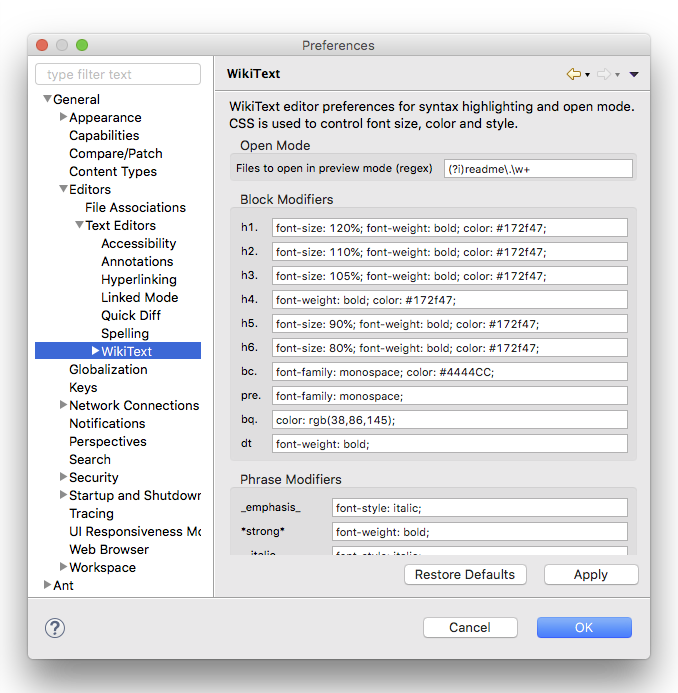
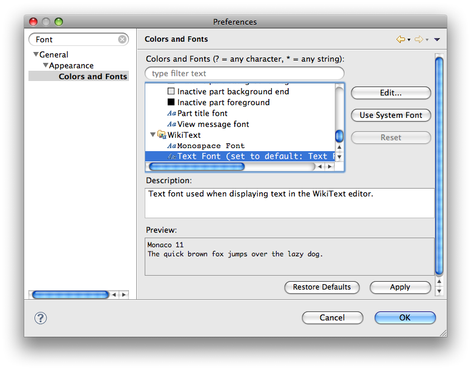
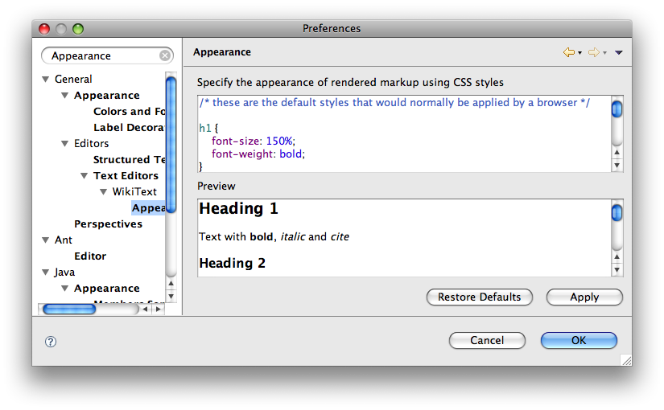

Preferences  
  
Tips and TricksUpgrading From Mylyn WikiText 2.x to 3.x  
  
* * *

# Preferences

WikiText editor preferences may be configured via the Eclipse preferences dialog. Preferences can be found under **General - > Editors -> Text Editors -> WikiText**.

## Editor Preferences

CSS styles are used to modify the markup syntax highlighting in the editor:

The following CSS styles are recognized:

`color`named or rgb(r,g,b)  
`background-color`named or rgb(r,g,b)  
`font-family`monospace, courier, courier new  
`font-style`italic, bold, normal  
`font-weight`bold, bolder, normal, lighter  
`font-size`percentage, named size, or absolute size (pt or px)  
`text-decoration`none, line-through, underline  
`vertical-align`super, sub  
  
### Open in Preview Mode

In the WikiText preference page shown above, it is possible to specify a name pattern (as a regular expression) for files that should be shown in preview mode when opened under **Files to open in preview mode (regex)**. The default setting matches readme files with any extension known to the WikiText editor. Opening files in preview mode improves browsing of project documentation, typically a readme file in the project root directory.

### Font Preferences

The WikiText editor default fonts can be configured in the Eclipse preferences dialog under **General - > Appearance -> Colors and Fonts**:

The **Text Font** is the default font used by the WikiText editor for displaying normal text. The **Monospace Font** is the default font used for displaying text that is teletype, preformatted or code. CSS styles are applied to these default fonts based on the Editor Preferences.

## Rendering Appearance

CSS styles are also used to modify the appearance of rendered markup, both in the text editor preview and in the Mylyn task editor:

See Editor Preferences for a list of supported styles.

* * *

  
Tips and TricksUpgrading From Mylyn WikiText 2.x to 3.x
