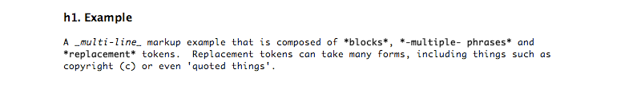
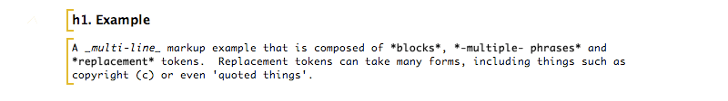
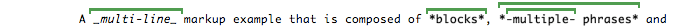
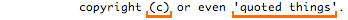

Markup Languages  
  
WikiText and the UIContributing  
  
* * *

# Markup Languages

Markup languages are the core concept that WikiText uses to define a parser for specific wiki markup. WikiText provides facilities for adding new markup languages or extending an existing one. All markup languages in WikiText extend the `org.eclipse.mylyn.wikitext.parser.markup.MarkupLanguage` class.

## Extending an Existing Markup Language

You may wish to augment an existing markup language syntax with your own extensions. With WikiText this is possible by subclassing an existing markup language.

MarkupLanguages that extend others may declare this hierarchy in the `org.eclipse.mylyn.wikitext.ui.markupLanguage` extension point by using the `extends` attribute. Declaring the hierarchy is optional, and allows for the markup language to inherit code completion, validation and help content from the markup language being extended.

## New Markup Languages

WikiText is designed to be extended to support new markup languages. To add a markup language take the following steps:

  1. Extend `org.eclipse.mylyn.wikitext.parser.markup.MarkupLanguage` using one of the existing subclasses as an example
  2. Add to your markup language class the blocks, phrases and replacement tokens that are to be part of your language (see Markup Language Concepts below)
  3. Add to your jar a Java service `META-INF/services/org.eclipse.mylyn.wikitext.parser.markup.MarkupLanguage`
  4. If it's to be used in Eclipse, register your markup language using the `org.eclipse.mylyn.wikitext.ui.markupLanguage` extension point. Other extension points that may be of interest to you:
     * `org.eclipse.core.contenttype.contentTypes` declare your markup language content type
     * `org.eclipse.team.core.fileTypes` ensure that team providers know that your file type is text
     * `org.eclipse.mylyn.wikitext.ui.markupValidationRule` provide markup validation to detect common problems in markup

You're most likely to be successful if you use one of the existing WikiText markup language plug-ins as an example. A good starting point is the `org.eclipse.mylyn.wikitext.textile` plug-in.

If you plan to implement a markup language then you should be familiar with Markup Language Concepts.

## Markup Language UI

To have a full featured UI for your markup language in Eclipse there are several additional extension points to be aware of:

  * `org.eclipse.mylyn.wikitext.ui.cheatSheet` a way of associating help content for your markup language
  * `org.eclipse.mylyn.wikitext.ui.contentAssist` a means of having content-assist for your markup language
  * `org.eclipse.mylyn.tasks.ui.taskEditorExtensions` make your markup language contribute to the Mylyn task editor

For more information on these and other UI functions, take a look at the `org.eclipse.mylyn.wikitext.textile.ui` plug-in.

## Markup Language Concepts

Every `MarkupLanguage` declares its syntax in terms of blocks, phrases, and replacement tokens. Though it is possible to create a markup language implementation that doesn't use these concepts, these are the building blocks of all markup languages implemented within WikiText.

Take for example the following Textile markup:

**Block**

A block is a multi-line region of text. Blocks are a way of 'chunking' a document, and loosely correspond to HTML concepts such as div, paragraph, list item, table cell, etc.

The example is composed of two blocks:

Though blocks may start and end anywhere on a line, they usually start at the beginning of one line and end with a line delimiter. Blocks must not overlap with other blocks and in most cases do not nest within one another. 

**Phrase**

A phrase is a single-line region of text. Phrases are often used to apply styles such as underline or bold to a region of text. Phrases are analogous to an HTML span.

The example shows phrases:

Phrases may not overlap but may be nested. Phrases must start and end on the same line. Phrases cannot span a block boundary.

**Replacement Token**

Replacement tokens are regions of text that are replaced with a corresponding element. For example, tokens may replace things such as '(c)' with (C). Replacement tokens can also be used to replace regions of text with the same text but semantic meaning, such as a hyperlink. 

The example has replacement tokens:

Replacement tokens cannot span a phrase or block boundary. Replacement tokens cannot be nested and must start and end on the same line. 

### Markup Language Implementation Tips

  1. The order that blocks, phrases and replacement tokens are declared by your markup language affect the markup syntax.
  2. When implementing a markup language, always ensure that there's one 'catch-all' block, usually the paragraph block. It should be last in the list of blocks declared by your language.
  3. Make extensive use of brief test cases that test for markup language syntax. WikiText has over 430 JUnit tests which we've found to be invaluable in verifying the expected behavior. Take a look at `TextileLanguageTest` for an example of how to write tests for your markup language.
  4. If in doubt, always use an existing WikiText markup language as an example.
  5. Feel free to post questions to the Mylyn newsgroup.

* * *

  
WikiText and the UIContributing
