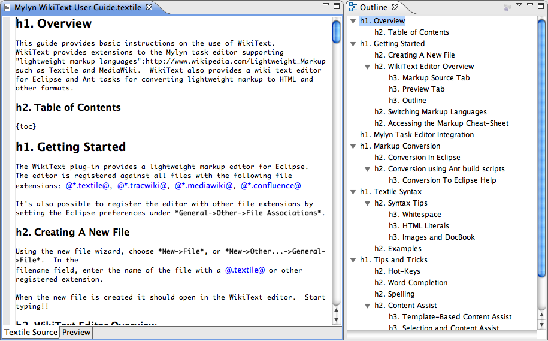
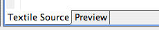
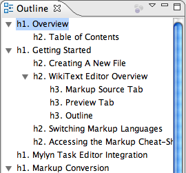
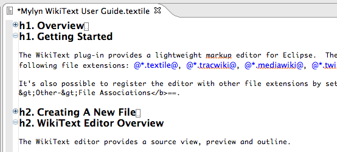
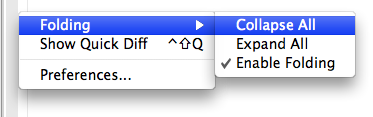
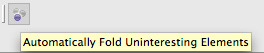
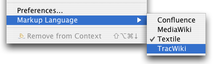
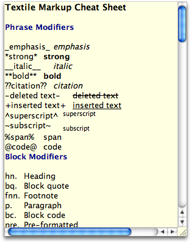
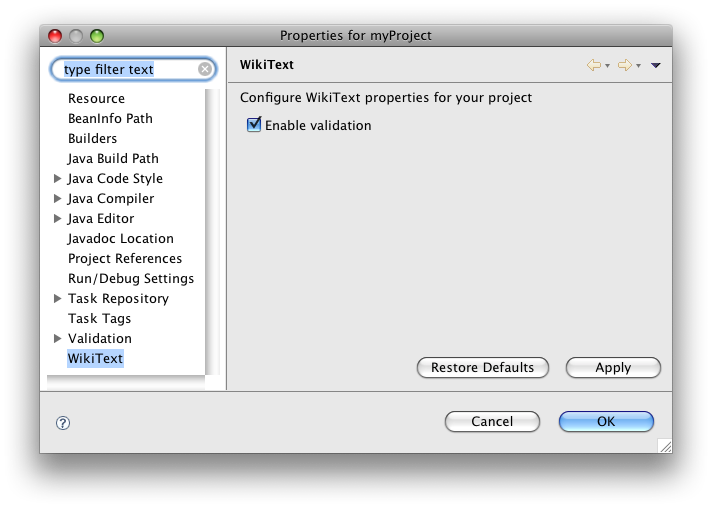

Getting Started  
  
OverviewTask Editor Integration  
  
* * *

# Getting Started

The WikiText plug-in provides a lightweight markup editor for Eclipse. The editor is registered against all files with the following file extensions: `*.ad`, `*.adoc`, `*.asciidoc`, `*.textile`, `*.tracwiki`, `*.markdown`, `*.md`, `*.mdtext`, `*.mediawiki`, `*.twiki`, `*.confluence`

It's also possible to register the editor with other file extensions by setting the Eclipse preferences under **General - > Other -> File Associations**.

## Creating A New File

Using the new file wizard, choose **New - > File**, or **New - > Other... -> General -> File**. In the  
filename field, enter the name of the file with a `.textile` or other registered extension.

When the new file is created it should open in the WikiText editor. Start typing!!

## WikiText Editor Overview

The WikiText editor provides a source view, preview and outline.

The editor has tabs on the bottom that facilitate switching to and from 'Source' and 'Preview'.

### Markup Source Tab

'Source' is the default editor pane. This is the area for editing markup such as Textile. The source pane provides syntax highlighting that should make it easier to see what the markup means.

Standard text editor actions are available here, such as copy/paste and find/replace. A "Preview at _[heading]_ " context menu is provided to open the preview tab at a specific section of the document. Explore the context menu and 'Edit' menu to see what actions are available.

### Preview Tab

The editor preview provides a preview of the wiki markup as it is rendered by your default browser after converting the markup to HTML. Though the 'Source' syntax highlighting is pretty good, the preview provides a more accurate view of the rendered result.

### Outline

The editor outline provides a structured view of the markup source. Headings in the markup are used to provide a 'Table of Contents'.

Clicking on an item in the outline will show the corresponding header in the source, and navigating in the source will cause the most relevant item in the outline to be selected.  
Clicking on an item in the outline when the preview is showing causes the corresponding item to be revealed.

Items in the outline view can be moved within the document by using the mouse to drag and drop the item to the desired location.

The Outline view can be displayed by selecting **Window - > Show View -> Outline** from the main menu.  
Also see [Quick Outline](<Tips-and-Tricks.md#QuickOutline>).

### Folding

The WikiText editor supports folding regions of text. Regions can be folded or expanded by clicking the folding indicators in the gutter.

Folding is enabled using the context menu in the editor gutter.

#### Active Folding

Folded regions can be managed by your Mylyn task context. With active folding enabled regions of the document that are not in the task context are folded and regions that are in the task context are expanded. As the task context changes Mylyn will fold and expand regions as needed.

To enable active folding first activate a Mylyn task then toggle the active folding button in the toolbar.

## Switching Markup Languages

The WikiText editor supports multiple markup languages. The editor makes a best-guess at the markup language from the file extension. To switch markup languages in the editor invoke the context menu **Markup Languages** and select the language:

The editor will remember your selection the next time the same file is opened.

## Accessing the Markup Cheat-Sheet

The editor provides a markup 'cheat-sheet'. The cheat-sheet is a quick-reference for markup syntax. To access the cheat-sheet press **F1** in the source view of the editor.

Note that the content of the cheat-sheet will vary according to the markup language being displayed.

## Project Settings

WikiText project settings may be configured from the project properties dialog.

Selecting **Enable validation** causes WikiText to validate wiki markup files in your project. This is done as part of the project build process, so it helps to have automatic building enabled (**Preferences- >Workspace->Build Automatically**). Validation is performed on all resources that match a wiki markup file extension. In addition validation includes any files for which the markup language setting was set even if the file doesn't have a registered wiki markup file extension.

* * *

  
OverviewTask Editor Integration
