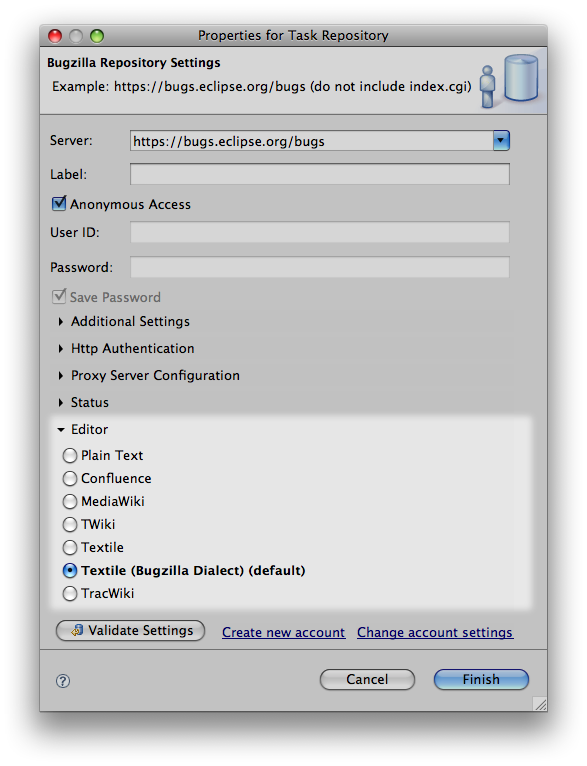
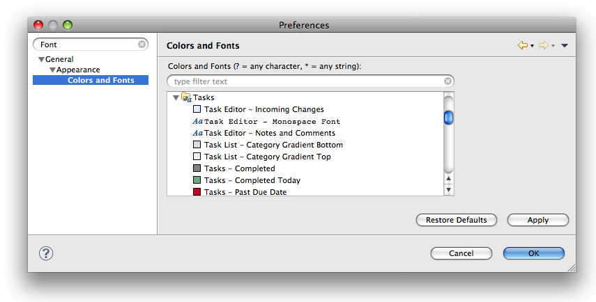
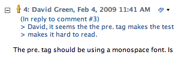
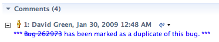

Task Editor Integration  
  
Getting StartedMarkup Generation  
  
* * *

# Task Editor Integration

WikiText extends Mylyn to provide a markup-aware task editor. With WikiText installed, Mylyn can render wiki markup as intended, provide markup-specific syntax highlighting, content-assist, validation, and a cheat-sheet for wiki markup syntax.

## Repository Configuration

To use the WikiText extension to the Mylyn task editor you may need to configure your Mylyn task repository. To do so, open the Mylyn **Task Repositories** view (**Window - > Show View -> Other... -> Mylyn -> Task Repositories**). Select the repository that you wish to configure and then select **Properties** from the context menu.

In the **Editor** section select the markup language of choice. Note that you may need to expand this section to see available choices. To disable WikiText extensions to the Mylyn task editor select **Plain Text**.

Press the **Finish** button when you've finished to make the changes permanent. Note that changes to these settings will only be visible for newly opened task editors. Task editors that were open prior to making the changes will need to be closed and reopened for the settings to take effect.

## Task Editor Appearance

The appearance of rendered markup in the task editor can be altered in the Eclipse preferences. Open **Preferences - > General -> Editors -> Text Editors -> WikiText -> Appearance** and alter the appearance using CSS styles. See [Preferences](<Preferences.md#Preferences>) for more details.

### Task Editor Fonts

Default fonts for the task editor when using WikiText can be altered in the Eclipse preferences. Open **Preferences - > General -> Appearance -> Colors and Fonts**. Under **Tasks** default fonts may be selected:

  * Task Editor - Monospace font
  * Task Editor - Notes and Comments

These fonts are used as the baseline before CSS styles are applied. See [Preferences](<Preferences.md#Preferences>) for more details.

## Markup for Task Repositories

Many task repositories have direct support for markup built in, such as Trac and JIRA. Others do not, however this does not prevent you from using markup with them.

Most markup languages are designed to be compact and readable in their source form. Early users of the Internet used markup in email and newsgroups without much thought and without the support of tools that alter the apperance of markup by rendering it as HTML.

We recommend using markup with task repositories such as Bugzilla. Markup makes content more readable and Mylyn can make it look good within Eclipse.

It should be noted that some markup languages such as WikiMedia and Textile were originally designed for wikis, not bug reports or task descriptions. Some markup language constructs of these languages are not suitable for use with task repositories, and are altered by WikiText when used with the Mylyn task editor. Below is a list of language features are altered when used with the Mylyn task editor:

**MediaWiki**

  * Preformatted text where the line begins with a space character has been disabled to prevent preformatted text where it was not intended.
  * Support for HTML tags has been disabled to allow for pasting HTML source code into bug comments and descriptions.

**Textile**

  * Support for HTML tags has been disabled to allow for pasting HTML source code into bug comments and descriptions.
  * Footnote references are preprocessed and only matched if a corresponding footnote exists in the content.

**Other**

The following language constructs are enabled for all markup languages:

  * Java stack trace detection
  * Eclipse-specific: content following a line starting with -- Error Details --

### Markup for Bugzilla

WikiText adds markup language capabilities for common Bugzilla content when used with a Bugzilla repository:

  * quoted text where each line begins with a > character:

  * common phrases generated by Bugzilla:

* * *

  
Getting StartedMarkup Generation
