Tips and Tricks  
  
Textile SyntaxPreferences  
  
* * *

# Tips and Tricks

## Hot-Keys

To get a pop-up showing the list of available hot-keys and commands, press **CTRL+SHIFT+l** (or **COMMAND+SHIFT+l** on a mac)

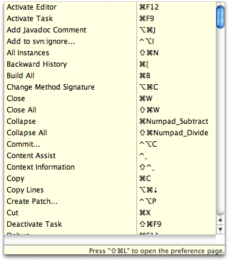

## Word Completion

Word completion is available from within the Textile editor. Press **CTRL+.** (that is CTRL + '.', the dot character) repeatedly to see available completions from the current cursor position.

Word completion is based on the [Hippie](<http://www.xemacs.org/Documentation/packages/html/edit-utils_23.md>) algorithm, which finds existing words in the editing context and uses them to create completion proposals.

## Spelling

Spell checking is enabled by default in the Textile editor. Pressing **CTRL+1** on a spelling issue will provide options for dealing with the spelling problem.

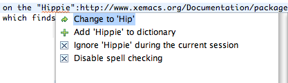

## Content Assist

Content assist is available by pressing **CTRL+SPACE**. Content assist will make suggestions based on the cursor position. If only one proposal is available at the cursor position, the content will be filled in automatically, otherwise a list of proposals is shown.

Continued typing while the proposals are displayed will narrow the list of available choices. A selection can be made with the mouse, or by using the up/down arrows and the enter key.

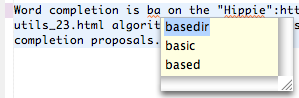

Suggestions include markup language syntax, document-internal anchor names and word suggestions.

### Cross-References and Content Assist

Content assist can help to create cross-reference links within your document. To create a cross-reference link, simply type a hash '#' character at the start of your link and use content assist to help you complete the cross-reference.

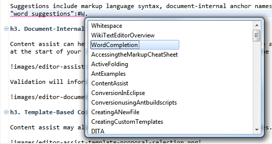

Validation will inform you if your link is incorrect.

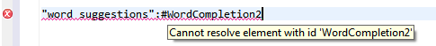

### Template-Based Content Assist

Content assist may also make proposals involving templates with variables.

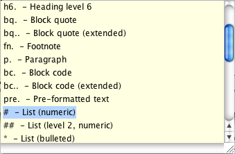

When such a proposal is selected the variables are displayed with a surrounding box. Typing replaces the variable content, the **TAB** key advances to the next variable position, and the **ENTER** or **ESC** keys complete the template editing session. The vertical line displayed at the end of the template shows where the cursor will be located when finished.

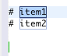

Note that while editing a template the standard undo/redo functionality is still available to you.

#### Creating Custom Templates

Custom templates can be created under **Preferences - > General -> Editors -> Text Editors -> WikiText -> Templates**:

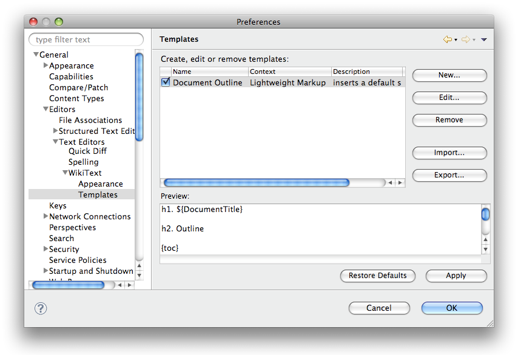

Templates may be large, such as a document outline, or small, such as a common phrase or token.

### Selection and Content Assist

Content assist may be invoked with selected text. To do so, select text using the mouse or keyboard, and then press **CTRL+SPACE**. Content assist is activated with the current selection.

Selecting a template-based content proposal will cause the selected text to be included in the template. The following shows a selection and content assist proposals before selecting a proposal:

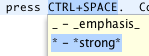

The following shows the same text after selecting a proposal:

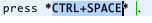

The selected text in this case is wrapped in '*' characters for the 'strong' Textile markup.

## Quick Outline

A quick outline can be accessed by pressing **CTRL+O** in the editor (**Command+O** on a mac). The quick outline provides a structured view of the markup source much the same as the [Outline view](<Getting-Started.md#Outline>) except that it's displayed right in the editor. A quick outline is useful when the Outline view is not visible and may also be used within the [task editor](<Task-Editor-Integration.md#TaskEditorIntegration>).

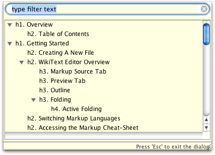

Clicking on an item in the outline will show the corresponding header in the source.

Also see [Outline](<Getting-Started.md#Outline>).

* * *

  
Textile SyntaxPreferences
